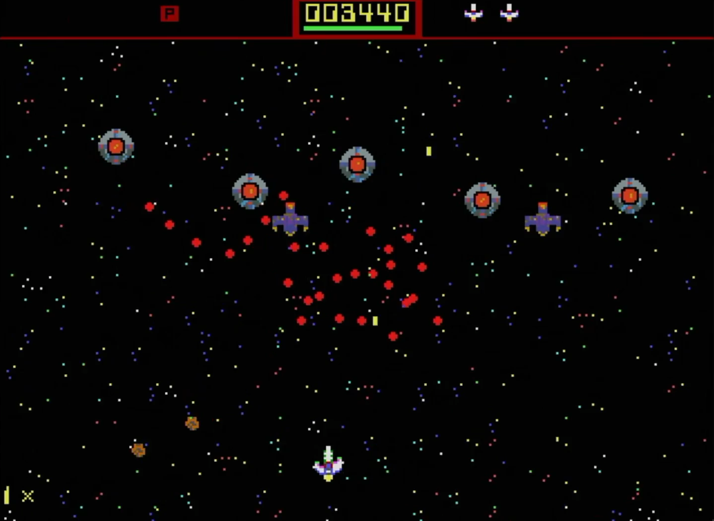

# RP6502 Game Demo for the [Picocomputer 6502](https://github.com/picocomputer) using the [RP6502 SDK](https://picocomputer.github.io/sdk.html) and [llvm-mos](https://github.com/llvm-mos/llvm-mos-sdk)

<!-- rp6502
preset: llvm-mos/Release
publish: RPStarHopper.zip
frames: 144
-->
[](https://jasonfrowe.github.io/RPDemo/RPStarHopper/)

[Run it in your browser](https://jasonfrowe.github.io/RPDemo/RPStarHopper/)

## Star Hopper — How to Play

Star Hopper is a vertical shoot-em-up for the Picocomputer (RP6502). Fight through 7 levels of enemy waves, defeat a boss at the end of each level, and survive to reach the YOU WIN screen. Your ship stays parked there for the fireworks and the boss parade; any key or button returns to the title.

### Controls

| Action | Keyboard | Gamepad |
|---|---|---|
| Move | W A S D, arrow keys, or keypad (7 9 1 3 move diagonally) | D-Pad or Left Stick |
| Fire (hold for auto-fire) | Any other key | A, B, X or Y |
| Pause / unpause | P, Pause or Enter | Start or Select |
| Start / continue | Any key | A, B, X, Y, Start or Select |

Holding fire on the bonus screen fast-forwards the tally.

### Enemies and Scoring

There are 7 enemy types, each worth more points than the last (10, 15, 20 … ). Destroying enemies without taking damage builds your **score multiplier** (1× up to 5×). Taking a hit resets the multiplier to 1×.

After clearing a level, a **bonus screen** tallies your kills per enemy type and awards bonus points scaled by the level number.

### Boss Fights

Each level ends with a boss encounter.  Bosses have a vulnerable point that is bright yellow.  Shoot it to deal damage.  Some bosses will only be vulnerable after certain conditions are met, which will be telegraphed visually.  For example, Boss Variant Four (Level 4) requires you to destroy all but one of the smaller enemies on screen before its vulnerable point will appear.

You have **4 minutes** to defeat the boss. If time runs out, the boss retreats and the level is marked **LEVEL FAILED**. Press any button to retry the same level.

### Asteroids and Power-Ups

Destroying asteroids can reveal power-up capsules. Pickups follow a fixed repeating sequence across the whole run:

| Icon | Pick-Up | Effect |
|---|---|---|
| **P** | Power | Increases fire rate (faster shots, down to a minimum cooldown) |
| **E** | Energy | Restores 8 HP |
| **S** | Speed | Raises your movement speed |


### Health

Your ship has 48 HP. The health bar at the top center turns red when HP drops to 12 or below. You have a brief invincibility window after each hit. Reaching 0 HP triggers a game-over.

You get an extra life every 100 000 points. Use them wisely.

---

## Table of Contents
- [Introduction](#introduction)
- [Platform Concepts](#platform-concepts)
- [Getting Started](#getting-started)
- [Provided Image Assets](#provided-image-assets)
- [Setting up Graphics](#setting-up-graphics)
- [Adding a Sprite](#adding-a-sprite)
- [Converting PNG Assets](#converting-png-assets)
- [Creating Graphics in Aseprite](#creating-graphics-in-aseprite)
- [Input System](#input-system)
- [Tilemaps and Backgrounds](#tilemaps-and-backgrounds)
- [Music](#music)
  - [Making Music in Furnace (OPL2/YM3812 -> VGM)](#making-music-in-furnace-opl2ym3812---vgm)
- [Animations and Palette Swapping](#animations-and-palette-swapping)
- [Adding Bullets](#adding-bullets)
- [Gameplay Loop](#gameplay-loop)
- [Enemies and Collision Detection](#enemies-and-collision-detection)
- [Gameplay Flow and Level Transitions](#gameplay-flow-and-level-transitions)

## Introduction

This is a complete shoot-em-up (**Star Hopper**) built for the Picocomputer (RP6502) with the [RP6502 SDK](https://picocomputer.github.io/sdk.html) and the llvm-mos C compiler. The game was written incrementally, and this README follows the same steps — you can read the code and explanations side by side and build your own game the same way.

The Picocomputer is built around a real WDC 65C02 CPU. Programming it feels like classic 8-bit development, but the surrounding hardware — VGA, OPL2 audio, gamepads, WiFi — is all modern and fully open source. Before jumping into code, it helps to understand a few concepts that are unique to this platform.

## Platform Concepts

### System RAM and XRAM

The 6502 sees 63.75 KB of system RAM (`0x0000–0xFEFF`). This is where program code, the stack, and variables live. The RP6502 also has a separate 64 KB called **Extended RAM (XRAM)**. XRAM is *not* directly addressable by the 6502 — there is no `LDA` or `STA` for it. Instead, the RIA chip provides two portals — `ADDR0/RW0` and `ADDR1/RW1` at hardware registers `0xFFE4–0xFFEB` — that let you read and write XRAM one byte at a time with auto-incrementing addresses. The LLVM-MOS SDK's `rp6502.h` wraps this in functions:

```c
xram0_write(XRAM_PLAYER_CONFIG, &sprites.player, sizeof(sprites.player));
```

XRAM has no fixed map: your program decides where everything goes. In this project that map is one file, `src/xram.h`. It defines the structures (such as `mode5_sprite_t`) and one `XRAM_` name for each address (such as `XRAM_PLAYER_CONFIG`). The map starts small in [Adding a Sprite](#adding-a-sprite) and grows as the tutorial goes on.

### XRAM is the VGA System's Memory

The most important concept: **the VGA module reads XRAM directly and continuously.** You do not call a "draw sprite at X, Y" function each frame. Instead, you write a sprite's configuration (position, frame pointer, palette pointer) into a small struct in XRAM once, and the VGA hardware renders it automatically on every frame — until you change it.

To move a sprite, you write two new 16-bit values into XRAM. There is no draw call. This is what makes smooth 60 FPS animation possible even on a slow 6502.

### Three Planes, Fill + Sprite Layers

The VGA system has three numbered planes (0, 1, 2). Each plane has two independent layers:
- A **fill layer** — a tile map, bitmap, or console that covers the plane background.
- A **sprite layer** — a pool of hardware sprites drawn over the fill.

Each mode covers a range of scanlines, and different ranges of the same plane can use different modes. This is how the gameplay tiles and sprites on planes 0 and 1 stay out of the top 24 scanlines, while the HUD tile map on plane 2 covers the full screen.

This demo's plane layout:

| Plane | Fill layer | Sprite layer |
|---|---|---|
| 0 | Background star tiles (scanlines 24–239) |  Projectile sprites (scanlines 24–239) |
| 1 | Foreground star tiles (scanlines 24–239) | Enemy sprites (scanlines 24–239) |
| 2 | HUD tile map (full screen) | Player (full screen) |

### Canvas and Vsync

`xreg_vga_canvas(CANVAS_320X240)` selects a canvas resolution. This demo uses `CANVAS_320X240` (320×240, 4:3). Available options:
- `CANVAS_CONSOLE` — 80-column console
- `CANVAS_320X240` — 320×240 (4:3)
- `CANVAS_320X180` — 320×180 (16:9)
- `CANVAS_640X480` — 640×480 (4:3)
- `CANVAS_640X360` — 640×360 (16:9)

These names and the `xreg_vga_canvas()` macro are not in `rp6502.h`. They come from the `xram.h` code block in the [VGA datasheet](https://picocomputer.github.io/vga.html)'s Key Registers section, which you copy into `src/xram.h`.

The VSYNC register at address `0xFFE3`, read with `ria_vsync()`, increments once per frame (~60 Hz) when a VGA module is connected. In practice, this tick is generated at the frame boundary (after the last programmed scanline), so it lines up closely with the start of vertical blanking. That gives you a short, reliable window to write XRAM without visible tearing.

Your game loop compares `ria_vsync()` against a saved value to know when a new frame has started:

```c
uint8_t vsync = ria_vsync();
if (vsync == vsync_last) continue;
vsync_last = vsync;
```

### ROM Assets and the XRAM Address Offset

In `CMakeLists.txt`, an XRAM asset is loaded at one of the `XRAM_` names from `src/xram.h`, wrapped in `XRAM()`:

```cmake
rp6502_map(RPStarHopper src/xram.h "XRAM_.*")
rp6502_asset(RPStarHopper XRAM(XRAM_PLAYER_DATA) images/Player_4bpp.bin)
```

Within your C code, XRAM is addressed `0x0000–0xFFFF`, and `XRAM_PLAYER_DATA` is one of those plain 16-bit addresses. Your `ADDR0` portal and all XRAM struct pointers always use them. The ROM file uses a different convention: the ROM loader uses addresses `0x10000–0x1FFFF` to mean "load this into XRAM". `XRAM()` bridges the two. It takes the 16-bit XRAM address your program uses, adds the loader's `0x10000`, and stops CMake with an error if the address is outside XRAM.

`rp6502_map()` is what lets CMake use the name at all. When CMake configures, it compiles `src/xram.h` and reads the value of every `#define` that matches `XRAM_.*`. Each address is written once, in the header, and never repeated in `CMakeLists.txt`. Change the header and the next build configures again, so CMake always agrees with the C code. It must come after `add_executable()` and before any `rp6502_asset()` that uses its names.

You will also see **named ROM assets** like `Title.vgm`. These are opened by name via `open("ROM:...")` and are not fixed XRAM addresses unless your code explicitly copies them into XRAM.

### Configuring Video Modes with XREG

`xreg_vga_mode2()` (tile maps) and `xreg_vga_mode5()` (sprites) install a video mode for a range of scanlines. Each one tells the VGA: "use this mode, reading configuration from XRAM address Y, on plane Z, for scanlines BEGIN up to END." Star Hopper calls them only at startup — not every frame.

```c
xreg_vga_mode2(options, config, plane, begin, end);
xreg_vga_mode5(options, config, length, plane, begin, end);
```

- `options` — color depth and tile/sprite size, built from named constants.
- `config` — the XRAM address of the mode's configuration: a `mode2_config_t`, or an array of `mode5_sprite_t`. In this project that is always an `XRAM_..._CONFIG` name from `src/xram.h`.
- `length` (Mode 5 only) — how many sprites are in the config array.
- `plane` — which of the three planes (0–2) to program.
- `begin`, `end` — the first scanline to program, and one past the last. An `end` of `0` means the bottom of the canvas.

Both macros come from the `xram.h` blocks in the Mode 2 and Mode 5 sections of the VGA datasheet. They are `xreg()` with the device, channel, register and mode number already filled in, which is why the mode number isn't an argument. `options` is a color depth OR'd with a size, using constants from the same blocks:

| Used for | `options` | Meaning |
|---|---|---|
| Player and enemy sprites | `MODE5_4BPP \| MODE5_16X16` | 16×16 sprites, 4bpp |
| Projectile sprites | `MODE5_4BPP \| MODE5_8X8` | 8×8 sprites, 4bpp |
| Background, foreground and HUD tiles | `MODE2_4BPP \| MODE2_8X8` | 8×8 tiles, 4bpp |

See the [VGA documentation](https://picocomputer.github.io/vga.html) for the full reference.

## Getting Started

Install the tools and start a project from the template with the [RP6502 SDK](https://picocomputer.github.io/sdk.html) documentation. Star Hopper builds with llvm-mos only, so this repo keeps just the llvm-mos presets. The image conversion scripts also need Pillow:

```bash
python3 -m pip install pillow
```

The tutorial starts from the template's `CMakeLists.txt`, with the program named `RPStarHopper`:

```cmake
cmake_minimum_required(VERSION 3.21)

include(${CMAKE_CURRENT_LIST_DIR}/tools/rp6502.cmake)

project(RPStarHopper C CXX ASM)

add_executable(RPStarHopper)
rp6502_map(RPStarHopper src/xram.h "XRAM_.*")
rp6502_asset(RPStarHopper help src/help.txt)
rp6502_executable(RPStarHopper DATA default RESET default)
rp6502_web(RPStarHopper)
target_sources(RPStarHopper PRIVATE
    src/main.c
)
```

## Provided Image Assets

Before we start graphics setup, here is what is already provided in `images/` and how each file is used.

### Runtime assets used by the game

| File | Size | Purpose |
|---|---:|---|
| `Player_4bpp.bin` | 768 bytes | Player sprite sheet (6 frames, 16x16, 4bpp). |
| `Projectiles_4bpp.bin` | 416 bytes | Projectiles, pickups, asteroids, and explosion frames (13 frames, 8x8, 4bpp). |
| `Enemies_4bpp.bin` | 22528 bytes | Enemy + boss sprite sheet (176 frames, 16x16, 4bpp). |
| `StarFields_tiles_4bpp.bin` | 8192 bytes | Shared tile pixel data for BG/FG/HUD; 8x8 tiles at 4bpp (256 tiles). |
| `StarFields_BG_map.bin` | 2400 bytes | Background tilemap index grid (40x60, 1 byte per tile). |
| `StarFields_FG_map.bin` | 2400 bytes | Foreground tilemap index grid (40x60, 1 byte per tile). |
| `StarFields_HUD_map.bin` | 1200 bytes | HUD tilemap index grid (40x30, 1 byte per tile). Also loaded a second time, at `XRAM_STARFIELD_HUD_DEFAULT`, which the game copies back to restore the title HUD. |

### Palette files

These are generated by the conversion script. CMakeLists.txt loads each `.bin` palette into XRAM along with the image and map assets above.

| File pattern | Purpose |
|---|---|
| `*_4bpp_palette.bin` | Raw 16-color palette data (32 bytes) for a converted asset. |
| `*_4bpp_palette.h` | C header with palette constants for compile-time use. |

Asset naming convention in this project:
- `*_4bpp.bin` = pixel data (tile/sprite frames)
- `*_map.bin` = tile index map data
- `*_palette.*` = palette data

### XRAM placement summary

Every XRAM asset is a member of `xram_layout_t` in `src/xram.h`, and `CMakeLists.txt` loads it with `rp6502_asset(RPStarHopper XRAM(<name>) <file>)`. The member's type sets its size, and its `XRAM_` name is the address the C code and CMake both use.

| `xram_layout_t` member | Address name | File | Size | Notes |
|---|---|---|---:|---|
| `palettes.player` | `XRAM_PLAYER_PALETTE` | `images/Player_4bpp_palette.bin` | 32 bytes | Player palette |
| `palettes.tile` | `XRAM_TILE_PALETTE` | `images/StarFields_tiles_4bpp_palette.bin` | 32 bytes | BG and FG tile palette |
| `palettes.tile_hud` | `XRAM_TILE_HUD_PALETTE` | `images/StarFields_tiles_4bpp_palette.bin` | 32 bytes | HUD tile palette; entries 2, 10 and 12 change at run time |
| `palettes.projectile` | `XRAM_PROJECTILE_PALETTE` | `images/Projectiles_4bpp_palette.bin` | 32 bytes | Projectile palette |
| `palettes.enemy` | `XRAM_ENEMY_PALETTE` | `images/Enemies_4bpp_palette.bin` | 32 bytes | Enemy palette |
| `player_data` | `XRAM_PLAYER_DATA` | `images/Player_4bpp.bin` | 768 bytes | Player sprite frames (`PLAYER_FRAME_COUNT` × `sprite_16x16_t`) |
| `starfield_bg_data` | `XRAM_STARFIELD_BG_DATA` | `images/StarFields_BG_map.bin` | 2400 bytes | BG tile index map |
| `starfield_fg_data` | `XRAM_STARFIELD_FG_DATA` | `images/StarFields_FG_map.bin` | 2400 bytes | FG tile index map |
| `starfield_hud_data` | `XRAM_STARFIELD_HUD_DATA` | `images/StarFields_HUD_map.bin` | 1200 bytes | HUD tile index map |
| `starfield_hud_default` | `XRAM_STARFIELD_HUD_DEFAULT` | `images/StarFields_HUD_map.bin` | 1200 bytes | HUD tile index map, copied to `starfield_hud_data` by `tile_mode2_restore_hud()` and `tile_mode2_commit()` |
| `starfield_tiles_data` | `XRAM_STARFIELD_TILES_DATA` | `images/StarFields_tiles_4bpp.bin` | 8192 bytes | Shared tile pixels (`STARFIELD_TILE_COUNT` × `tile_8x8_t`) |
| `projectile_data` | `XRAM_PROJECTILE_DATA` | `images/Projectiles_4bpp.bin` | 416 bytes | Projectile/pickup/asteroid/explosion frames |
| `enemy_data` | `XRAM_ENEMY_DATA` | `images/Enemies_4bpp.bin` | 22528 bytes | Enemy + boss frames |
| `sfx_data` | `XRAM_SFX_DATA` | `music/sfx/sfx_xram.bin` | 2204 bytes | SFX command streams (`SFX_DATA_SIZE`, generated by `tools/generate_sfx.py`) |

There is no address column, because nobody writes the addresses down. The compiler works each one out from the layout, so when something grows, everything after it moves and both the C code and CMake follow. `sfx_data` is the last member so that regenerating the SFX never moves anything else.

The layout also holds XRAM the program fills in at run time rather than loading from the ROM: the OPL2 registers (`XRAM_OPL`, the first member so it starts on a page boundary), the mode configurations (`XRAM_PLAYER_CONFIG`, `XRAM_TILE_BG_CONFIG` and the rest), and the keyboard and gamepad input that the RIA writes (`XRAM_KEYBOARD`, `XRAM_GAMEPAD`).

## Setting up Graphics

The documentation for the Picocomputer is excellent:
https://picocomputer.github.io

For this demo we are going to work with a 320x240 canvas.   Let's start by initializing the graphics system.  We can do this by calling the xreg_vga_canvas function with a parameter of `CANVAS_320X240`.

`xreg_vga_canvas()` and `CANVAS_320X240` are not part of `rp6502.h`. Open the [VGA datasheet](https://picocomputer.github.io/vga.html), find the code block captioned `xram.h` in the Key Registers section, select the C tab, and use its "Copy to clipboard" button. Paste it into `src/xram.h`, after the `#include` lines. Leave the template's placeholder layout (`xram_feature_t` and `XRAM_FOO`) where it is for now; the next section replaces it with a real one.

Add the following to your main.c file, as well as ```#include <stdbool.h>``` at the top of the file:


```c
static bool init_graphics(void)
{
    // 320×240 canvas
    int rc;
    rc = xreg_vga_canvas(CANVAS_320X240);
    if (rc < 0) {
        return false;
    }
    return true;
}
```

If ```xreg_vga_canvas()``` returns a negative value, there was an error initializing the graphics system, so we return false.  We can now call this function from our main, and also set up a vsync loop to keep the program running.  Update your main function to look like this:

```c
int main(void)
{
    if (!init_graphics()) {
        return 1;
    }

    // Main loop
    uint8_t vsync_last = 0;
    while (true) {
        // 1. SYNC
        uint8_t vsync = ria_vsync();
        if (vsync == vsync_last) continue;
        vsync_last = vsync;
    }

    return 0;
}
```

This creates a loop that runs once per frame, synced to the vertical refresh of the display.

If you build and run this code, you should see a blank screen on your Picocomputer.  In the next section, we will start drawing some pixels to the screen!  To exit the program hit ```ALT + F4``` on the keyboard connected to your Picocomputer.

## Adding a Sprite

We are going to use the Mode 5 sprite system for the demo.  We are going to add a 4-bpp (16-color) sprite with a custom palette and start to get a feel for the XRAM system.   The images folder contains ```Player_4bpp.bin``` which is a 16x16 pixel tile-based Sprite in the 4-bpp format.  We will learn later how to make our own sprites and convert them to the correct format.

We are going to load this sprite into XRAM and then draw it to the screen.  First, we need to add the sprite as an asset in our CMakeLists.txt file.  Update your CMakeLists.txt to add a new rp6502_asset for the sprite and one for its palette.  Your CMakeLists.txt should now look like this:

```cmake
cmake_minimum_required(VERSION 3.21)

include(${CMAKE_CURRENT_LIST_DIR}/tools/rp6502.cmake)

project(RPStarHopper C CXX ASM)

add_executable(RPStarHopper)
rp6502_map(RPStarHopper src/xram.h "XRAM_.*")

rp6502_asset(RPStarHopper XRAM(XRAM_PLAYER_DATA) images/Player_4bpp.bin)
rp6502_asset(RPStarHopper XRAM(XRAM_PLAYER_PALETTE) images/Player_4bpp_palette.bin)
rp6502_asset(RPStarHopper help src/help.txt)

rp6502_executable(RPStarHopper DATA default RESET default)
rp6502_web(RPStarHopper)

target_sources(RPStarHopper PRIVATE
    src/main.c
)
```

This will place the sprite in XRAM at `XRAM_PLAYER_DATA` and its palette at `XRAM_PLAYER_PALETTE`.  So where are those?  We decide, in `src/xram.h`, which has two parts.

First come the structures of each device the program uses. You don't write these yourself: each one is in the [RIA](https://picocomputer.github.io/ria.html) or [VGA](https://picocomputer.github.io/vga.html) datasheet, in a code block captioned `xram.h`, together with the device's constants and XREG macro. Select the C tab and use the block's "Copy to clipboard" button to paste the whole block into `src/xram.h`. For the player sprite we need two blocks from the VGA datasheet: the Key Registers block you already copied (the canvas), and the block from the "Mode 5: Sprite 1,2,4,8-bit" section. The part of the Mode 5 block we use first is the structure that configures one sprite:

```c
typedef struct
{
    int16_t x_pos_px;
    int16_t y_pos_px;
    uint16_t xram_sprite_ptr;
    uint16_t palette_ptr;
} mode5_sprite_t; /* layout */
```

Then comes the layout: one `xram_layout_t` struct that places everything the program keeps in XRAM, one member after another, and one `#define XRAM_<NAME> offsetof(xram_layout_t, <member>)` that names each address. `xram_layout_t` is never created as a variable. It only describes XRAM, and `offsetof()` turns each member into its address. Replace the template's placeholder layout with this one for the player:

```c
#ifndef XRAM_H
#define XRAM_H

#include <rp6502.h>
#include <stdbool.h>
#include <stddef.h>
#include <stdint.h>
#include "constants.h"

/* VGA Canvas */
/* ...the xram.h block from the VGA datasheet's Key Registers section... */

/* VGA Mode 5: Sprite */
/* ...the xram.h block from the VGA datasheet's Mode 5 section... */

/* Star Hopper's XRAM. Every asset and config is 4-bit color, */
/* so the images are 16-color and each palette has 1 << 4 entries. */

typedef MODE5_IMAGE(4, 16) sprite_16x16_t;

#define PLAYER_FRAME_SIZE sizeof(sprite_16x16_t)

typedef struct
{
    mode5_sprite_t player;
} sprite_configs_t;

typedef struct
{
    uint16_t player[1 << 4];
} palettes_t;

_Static_assert(sizeof(palettes_t) <= 1024,
               "Palettes beyond 1 KB collide in the 1 KB palette cache of the FPGA VGA.");

typedef struct
{
    sprite_configs_t sprites;
    palettes_t palettes;
    sprite_16x16_t player_data[PLAYER_FRAME_COUNT];
} xram_layout_t;

#define XRAM_SPRITE_CONFIGS offsetof(xram_layout_t, sprites)
#define XRAM_PLAYER_CONFIG offsetof(xram_layout_t, sprites.player)
#define XRAM_PLAYER_PALETTE offsetof(xram_layout_t, palettes.player)
#define XRAM_PLAYER_DATA offsetof(xram_layout_t, player_data)

#endif
```

`MODE5_IMAGE(4, 16)` comes from the Mode 5 block, and declares one 16x16 image at 4 bits per pixel (4bpp): 16 rows of 8 bytes, 128 bytes (16 * 16 * 4 bits / 8 bits per byte = 128 bytes).  The player sprite sheet is six of them, 768 bytes.  The player's palette is 16 colors of 2 bytes each, 32 bytes.  Every palette goes in `palettes_t`, and the `_Static_assert` fails the build if they outgrow the 1 KB palette cache of the FPGA VGA.  The sprite config, `mode5_sprite_t`, is 8 bytes, and every sprite config goes in `sprite_configs_t`.

There is no hex math anywhere in this file.  The compiler works out every address from the sizes of the members before it, so in this layout `XRAM_PLAYER_CONFIG` is 0, `XRAM_PLAYER_PALETTE` is 8, and `XRAM_PLAYER_DATA` is 40.  If the sprite sheet gets another frame, or we add a member in the middle, every address after it moves automatically.  CMake reads the very same names through `rp6502_map()`, so `XRAM(XRAM_PLAYER_DATA)` in CMakeLists.txt always matches `XRAM_PLAYER_DATA` in the C code, and no address is ever written twice.  `rp6502_map()` also checks the layout for you: the build fails if an address is odd (mode configurations and palettes are read as 16-bit values, so they need an even address) or if the layout is larger than the 64 KB of XRAM.  The [XRAM Memory Map](https://picocomputer.github.io/sdk.html#xram-memory-map) section of the SDK documentation describes this file in full.

The sizes and counts that the layout and the game code use live in ```constants.h```, which `xram.h` includes.  A file that includes `xram.h` gets both.

```c
#ifndef CONSTANTS_H
#define CONSTANTS_H

// Screen dimensions -- must match xreg_vga_canvas(CANVAS_320X240) in main.c
#define SCREEN_WIDTH 320
#define SCREEN_HEIGHT 240

// Sprite and tile data. The XRAM layout that holds them is src/xram.h.
#define PLAYER_SPRITE_SIZE_PX   16                 // Player sprite is 16x16 pixels
#define PLAYER_FRAME_COUNT      6                  // idle, right, left, explode frames (3, 4, 5)

#endif // CONSTANTS_H
```

Now let's create ```sprite_mode5.c``` and ```sprite_mode5.h``` to set up the sprite and write its configuration to XRAM.  Here is ```sprite_mode5.c```:

```c
#include <rp6502.h>
#include <stdint.h>
#include "constants.h"
#include "sprite_mode5.h"

static sprite_configs_t sprites;

void sprite_mode5_init(void) {
    static const mode5_sprite_t config = {
        .x_pos_px = (SCREEN_WIDTH - PLAYER_SPRITE_SIZE_PX) / 2,
        .y_pos_px = (SCREEN_HEIGHT - PLAYER_SPRITE_SIZE_PX) * 2 / 3, // Start slightly lower than center for better composition
        .xram_sprite_ptr = XRAM_PLAYER_DATA,
        .palette_ptr = XRAM_PLAYER_PALETTE,
    };

    sprites.player = config;
    xram0_write(XRAM_PLAYER_CONFIG, &sprites.player, sizeof(sprites.player));

    // Mode 5 args: OPTIONS, CONFIG, LENGTH, PLANE, BEGIN, END
    xreg_vga_mode5(MODE5_4BPP | MODE5_16X16, XRAM_PLAYER_CONFIG, 1, 2, 0, 0);
}

void sprite_mode5_commit(void)
{
    xram0_write(XRAM_SPRITE_CONFIGS, &sprites, sizeof(sprites));
}
```

`sprites` is a RAM copy of the sprite configurations.  The main loop calls `sprite_mode5_commit()` right after vsync to write it to XRAM, so a sprite changes only between frames.

Here is the code for ```sprite_mode5.h```.  It doesn't declare the sprite structure itself: `mode5_sprite_t` comes from `xram.h`.

```c
#ifndef SPRITE_MODE5_H
#define SPRITE_MODE5_H

#include "xram.h"

void sprite_mode5_init(void);
void sprite_mode5_commit(void);

#endif // SPRITE_MODE5_H
```

We need to update our CMakeLists.txt to include the new source file:

```cmake
target_sources(RPStarHopper PRIVATE
    src/main.c
    src/sprite_mode5.c
)
```

and update main.c to look like this:

```c
#include <rp6502.h>
#include <stdbool.h>
#include "xram.h"
#include "sprite_mode5.h"

static bool init_graphics(void)
{
    // 320×240 canvas
    int rc;
    rc = xreg_vga_canvas(CANVAS_320X240);
    if (rc < 0) {
        return false;
    }

    sprite_mode5_init();

    return true;
}

int main(void)
{
    if (!init_graphics()) {
        return 1;
    }

    // Main loop
    uint8_t vsync_last = 0;
    while (true) {
        // 1. SYNC
        uint8_t vsync = ria_vsync();
        if (vsync == vsync_last) continue;
        vsync_last = vsync;

        // 2. COMMIT
        sprite_mode5_commit();
    }

    return 0;
}
```
At this point, if you build and run the code, you should see your player sprite a little below the center of the screen.  In the next sections we will learn how to convert PNGs and then add movement to our sprite.


## Converting PNG Assets

Use `tools/convert_sprite.py` to convert source PNG files into binary assets for RP6502.

Basic usage:

```bash
python3 ./tools/convert_sprite.py <input_file> [--bpp 1|2|4|8|16] [--mode tile|bitmap] [--out-dir images] [--extract-palette]
```

Key options:

- `--mode tile` (default): treats the image as a horizontal strip of square frames where `tile_size = image_height` and `image_width` must be a multiple of `image_height`.
- `--mode bitmap`: exports full scanline bitmap data (no frame splitting).
- `--bpp`: output format. If omitted, the script auto-detects from image mode/color usage.
- `--extract-palette`: for indexed formats (1/2/4/8 bpp), also writes:
    - `<name>_<bpp>bpp_palette.bin`
    - `<name>_<bpp>bpp_palette.h`

Example commands used in this project:

```bash
# Player sprite sheet (16x16 frames in a horizontal strip)
python3 ./tools/convert_sprite.py --bpp 4 --mode tile --extract-palette Sprites/Player.png

# Enemy sprite sheet
python3 ./tools/convert_sprite.py --bpp 4 --mode tile --extract-palette Sprites/Enemies.png

# Projectile/asteroid sheet
python3 ./tools/convert_sprite.py --bpp 4 --mode tile --extract-palette Sprites/Projectiles.png

# Tile set (8x8 tiles in a horizontal strip)
python3 ./tools/convert_sprite.py --bpp 4 --mode tile --extract-palette Sprites/StarFields_tiles.png

```

Output naming convention:

- Main binary: `<name>_<bpp>bpp.bin`
- Palette binary/header (if requested): `<name>_<bpp>bpp_palette.bin` and `<name>_<bpp>bpp_palette.h`

The default `--out-dir` is `images`, so these commands write the files that `rp6502_asset(...)` entries in `CMakeLists.txt` load.

Auto-detection may not be dependable.  If the input PNG is not indexed, or uses more colors than the requested BPP allows, the script requantizes the palette, which may lead to unexpected color changes.  For best results, create your source PNGs in the target color depth (for example, Indexed Color mode with 16 colors for 4bpp) and use the `--bpp` flag to explicitly specify the output format.

## Creating Graphics in Aseprite

Aseprite is a very good fit for RP6502 graphics work because the Picocomputer's tile and sprite modes are fundamentally palette-based. If you build your art as indexed-color pixel art from the start, the exported data maps cleanly into Mode 2 tiles and Mode 5 sprites.

### Why 4bpp is the sweet spot

For this project, **4bpp** has been the practical sweet spot:
- `4bpp` means 16 colors per asset palette.
- Files are half the size of `8bpp` assets and one quarter the size of `16bpp` assets.
- Smaller files use less XRAM, make ROMs smaller, and reduce the amount of data that has to be copied into XRAM.
- On RP6502, that also means less PIX/XRAM traffic whenever you stream or update pixel data.

For the same image dimensions, memory scales directly with bits per pixel:

| Asset type | 4bpp | 8bpp | 16bpp |
|---|---:|---:|---:|
| One 8x8 tile | 32 bytes | 64 bytes | 128 bytes |
| One 16x16 sprite frame | 128 bytes | 256 bytes | 512 bytes |

Using this repo's actual art assets, the numbers look like this:

| Asset | Current size at 4bpp | Equivalent at 8bpp | Equivalent at 16bpp |
|---|---:|---:|---:|
| Player sprite sheet (`6` frames, `16x16`) | 768 bytes | 1536 bytes | 3072 bytes |
| Tile set (`StarFields_tiles_4bpp.bin`, `256` tiles, `8x8`) | 8192 bytes | 16384 bytes | 32768 bytes |
| Projectile sheet (`13` frames, `8x8`) | 416 bytes | 832 bytes | 1664 bytes |
| Enemy sheet (`176` frames, `16x16`) | 22528 bytes | 45056 bytes | 90112 bytes |

The three tile maps are index grids, so their size does **not** change with color depth:
- Background map: 2400 bytes
- Foreground map: 2400 bytes
- HUD map: 1200 bytes, loaded twice

That gives these total XRAM requirements for the current visual assets:

| Format choice | Total asset memory |
|---|---:|
| Current 4bpp setup | 39104 bytes |
| Same assets at 8bpp | 71008 bytes |
| Same assets at 16bpp | 134816 bytes |

Since XRAM is only 65536 bytes total, the current 4bpp setup fits, but the same art at 8bpp would already overflow XRAM before accounting for config structs, palettes, input buffers, or OPL registers. That is the strongest practical reason to stay with 4bpp unless you truly need more colors.

Note: The Picocomputer has fast access to USB flash media, so it is technically possible to stream larger assets from storage into XRAM on demand. However, that adds complexity and is out of scope for this project.

One more important detail: Picocomputer **Mode 2** tiles and **Mode 5** sprites are palette-based modes and top out at `8bpp`. A `16bpp` version of the same art would require different video modes and much more memory, so 16-bit color is usually the wrong choice for this style of game.

### Aseprite workflow for sprites

For sprite sheets such as the player, enemies, and projectiles:

1. Create the artwork in **Indexed Color** mode.
2. Keep each frame square if you plan to use `--mode tile` with `convert_sprite.py`.
3. Arrange animation frames horizontally in one strip.
4. Keep the image height equal to the frame size.

Examples from this project:
- Player sheet: `16x16` frames in a horizontal strip
- Enemy sheet: `16x16` frames in a horizontal strip
- Projectile sheet: `8x8` frames in a horizontal strip

That layout matches the converter's expectations:

```bash
python3 ./tools/convert_sprite.py Sprites/Player.png --mode tile --bpp 4 --out-dir images --extract-palette
```

### Making a tile map in Aseprite

For scrolling backgrounds and HUD layers, Aseprite's tilemap tools are a good fit.

Recommended workflow:

1. Create or import your tile artwork as an indexed-color tileset.
2. Make sure the layer you paint on is an actual **TileMap** layer in Aseprite, not a normal raster layer.
3. Paint the level or background using tile IDs instead of drawing pixels directly.
4. Export the **tileset artwork** as well as the tilemap itself. RP6502 needs both pieces: the tile pixels and the tile index grid.
5. Keep your tile size aligned with the mode you plan to use on RP6502.

For this project, the tile system uses:
- `8x8` tiles
- up to `256` tile IDs
- one byte per tile in the exported map

The key idea is that the tilemap file is just a grid of tile indices. The tile pixels live in a separate tileset binary, and the map only says which tile goes at each position.

For this project, that means you typically export two different things from Aseprite:
- The **tileset image** itself, which later becomes something like `StarFields_tiles_4bpp.bin`
- The **tilemap layer**, which becomes something like `StarFields_BG_map.bin`

### Exporting tilemaps with `tools/export_map.lua`

This project includes [tools/export_map.lua](tools/export_map.lua), which is the exact tool used to export the game's tilemaps.

What the script does:
- Reads the **active sprite** in Aseprite
- Requires the **active layer** to be a **tilemap layer**
- Reads the **active frame**
- Exports the tilemap as raw bytes, one byte per tile, row by row

Important quirk:
- The script exports the tilemap based on Aseprite's **bounding box** for the tile content, not a fixed logical map size.
- In practice, that means you should place a non-transparent tile at the **top-left** corner and another at the **bottom-right** corner of the map area you want exported.
- If you do not do this, Aseprite may crop the exported tilemap smaller than you expected.

That exported `.bin` file can be used directly as an RP6502 tilemap asset.

Example flow:

1. Open your Aseprite tilemap file.
2. Confirm that the layer you want to export is a **TileMap** layer.
3. Export the tileset artwork separately.
4. Select the tilemap layer you want to export.
5. Make sure there is a non-transparent tile at the top-left and bottom-right corners of the area you want exported.
6. Run the Lua script from Aseprite.
7. Save the output as something like `StarFields_BG_map.bin`.
8. Add a member for each to `xram_layout_t` in `src/xram.h`, with its `XRAM_` define, sized from the map's width and height in tiles (see [Tilemaps and Backgrounds](#tilemaps-and-backgrounds)).
9. Add both the tileset asset and the tilemap asset to `CMakeLists.txt`, loaded at those names.

Example, in `src/xram.h` (the member inside `xram_layout_t`, the define after it) and in `CMakeLists.txt`:

```c
uint8_t starfield_bg_data[STARFIELD_BG_HEIGHT][STARFIELD_BG_WIDTH];

#define XRAM_STARFIELD_BG_DATA offsetof(xram_layout_t, starfield_bg_data)
```

```cmake
rp6502_asset(RPStarHopper XRAM(XRAM_STARFIELD_BG_DATA) images/StarFields_BG_map.bin)
```

The script writes one byte per tile ID, row by row, so the file loads straight into that `uint8_t` array.

### Study the source art

The [Sprites](Sprites) folder contains the Aseprite source files used to build this game. These are useful reference material if you are learning the workflow or want to reuse the same setup for your own project.

Relevant files include:
- `Player.aseprite`
- `Enemies.aseprite`
- `Projectiles.aseprite`
- `StarFields.aseprite`
- `Boss_001.aseprite` through `Boss_07.aseprite`

If you want to learn how the graphics were organized, start there. You can inspect frame layout, palette usage, tilesets, and tilemap structure directly in Aseprite instead of guessing from the exported binary files.

### Practical advice

- Use indexed color early. Converting full-color art down later is usually painful.
- Keep your tile and sprite palettes intentional and limited.
- Prefer 4bpp unless there is a concrete visual reason to move to 8bpp.
- Treat tilemaps and tilesets as separate assets: one file for tile pixels, one file for tile placement.
- If an asset is going into Mode 2 or Mode 5, think in terms of palettes and tile/sprite frames, not full-color bitmaps.

## Input System

We are going to use ```input.c```, ```input.h```, ```player_controller.c```, and ```player_controller.h``` which are designed to make handling inputs a bit easier and also allow for custom key mappings for any gamepad you want to use.  To get started add ```input.c``` and ```player_controller.c``` to CMakeLists.txt and include the headers in main.c.

We need to allocate XRAM to fetch the current state of the inputs.  The RIA writes the keyboard and gamepad state into XRAM continuously, but XRAM has no fixed map: the program chooses where that state goes and tells the RIA with an XREG.  In our `src/xram.h` file, that means adding the input devices to the layout.

First copy two more `xram.h` blocks, both from the [RIA datasheet](https://picocomputer.github.io/ria.html): the one in the Keyboard section, which defines `keyboard_t` (a 32-byte bit array of USB HID keycodes) and `xreg_ria_keyboard()`, and the one in the Gamepads section, which defines `gamepad_player_t` (10 bytes for one gamepad), `gamepad_t` (4 of them, 40 bytes) and `xreg_ria_gamepad()`.  Then add a member for each to `xram_layout_t`, with a name for each address:

```c
typedef struct
{
    sprite_configs_t sprites;

    keyboard_t keyboard;
    gamepad_t gamepad;

    palettes_t palettes;
    sprite_16x16_t player_data[PLAYER_FRAME_COUNT];
} xram_layout_t;

#define XRAM_SPRITE_CONFIGS offsetof(xram_layout_t, sprites)
#define XRAM_PLAYER_CONFIG offsetof(xram_layout_t, sprites.player)

#define XRAM_KEYBOARD offsetof(xram_layout_t, keyboard)
#define XRAM_GAMEPAD offsetof(xram_layout_t, gamepad)

#define XRAM_PLAYER_PALETTE offsetof(xram_layout_t, palettes.player)
#define XRAM_PLAYER_DATA offsetof(xram_layout_t, player_data)
```

The input members go before the palettes and the sprite data, which pushes `XRAM_PLAYER_PALETTE` and `XRAM_PLAYER_DATA` up by 72 bytes.  Nothing else needs to change: the C code and the `XRAM()` names in CMakeLists.txt pick up the new addresses on the next build.  `input.c` reads the state from `XRAM_KEYBOARD` and `XRAM_GAMEPAD`, so `input.h` includes `xram.h` too.

Then update your main function to look like:

```c
int main(void)
{

    // Initialize input
    xreg_ria_keyboard(XRAM_KEYBOARD);
    xreg_ria_gamepad(XRAM_GAMEPAD);

    // Initialise graphics
    if (!init_graphics()) {
        return 1;
    }
    init_input_system();
    player_controller_init();

    // Main loop
    uint8_t vsync_last = 0;
    while (true) {
        // 1. SYNC
        uint8_t vsync = ria_vsync();
        if (vsync == vsync_last) continue;
        vsync_last = vsync;

        // 2. COMMIT
        sprite_mode5_commit();

        // 3. INPUT
        handle_input();

        player_controller_update();
    }

    return 0;
}
```

Let's break this down.
```c
    // Initialize input
    xreg_ria_keyboard(XRAM_KEYBOARD);
    xreg_ria_gamepad(XRAM_GAMEPAD);
```
This sets the XRAM addresses for the keyboard and gamepad inputs and enables the devices.  `xreg_ria_keyboard()` and `xreg_ria_gamepad()` are the XREG macros from the blocks we just copied; each one is `xreg()` with the RIA's device, channel and register filled in.

```c
    init_input_system();
    player_controller_init();
```
This initializes our input handling system and our player controller.  The input system will also look for `JOYSTICK_SH.DAT` and if it exists, it will load extra gamepad mappings from that file (see [Mapping any gamepad with `GamepadMapper`](#mapping-any-gamepad-with-gamepadmapper) below).

### Game actions

The game never asks "is the X button down?". It asks about actions:

```c
typedef enum {
    ACTION_MOVE_UP,
    ACTION_MOVE_DOWN,
    ACTION_MOVE_LEFT,
    ACTION_MOVE_RIGHT,
    ACTION_FIRE,
    ACTION_PAUSE,
    ACTION_START,
    ACTION_COUNT  // Total number of actions
} GameAction;
```

`handle_input()` reads the keyboard and gamepad state from XRAM once per frame and turns it into one bit per action, and `is_action_pressed(ACTION_FIRE)` just tests a bit.  The keyboard and the gamepad feed the same actions, so the rest of the game doesn't care which one you're using:

| Action | Keyboard | Gamepad |
|---|---|---|
| `ACTION_MOVE_*` | W A S D, arrow keys, or keypad 8/4/6/2 (7/9/1/3 set two directions) | D-Pad or left stick |
| `ACTION_FIRE` | every key except the move keys, P, Pause and Enter | A, B, X or Y |
| `ACTION_PAUSE` | P, Pause or Enter | Start or Select |
| `ACTION_START` | any key | A, B, X, Y, Start or Select |

The keyboard block is a bit array of USB HID keycodes, one bit per key, so "any other key fires" is a mask: `init_input_system()` starts from all 256 bits and clears the move and pause keys, and `handle_input()` ANDs the keyboard state with it.  Two details of the keyboard block matter here.  Keycodes 0 to 3 aren't keys: bit 0 (`KEYBOARD_NO_KEY`) is set while *no* key is pressed, and bits 1 to 3 are the Num, Caps and Scroll Lock lamps, which stay set while the lamp is on.  They are cleared from both the fire mask and the "any key" test, or Caps Lock would fire forever.  Keypad keys report the same keycodes whether Num Lock is on or off, so the keypad always moves the ship.

On a gamepad, the top four bits of the dpad byte are the pad's type and status (`GAMEPAD_FEAT_CONNECTED`, `GAMEPAD_FEAT_STICKS` and the button labelling), so the input system only reads a pad whose connected bit is set, and masks the dpad byte down to its four direction bits before testing them.

### Mapping any gamepad with `GamepadMapper`

This repo includes a small utility program (`src/gamepad_mapper.c`) that lets you map controls for an unusual gamepad and save the result to `JOYSTICK_SH.DAT`.  Most gamepads don't need it: the RIA reports every gamepad in the same layout, and all four face buttons fire.

What it does:
- Prompts you for each control (`MOVE UP`, `MOVE DOWN`, `MOVE LEFT`, `MOVE RIGHT`, `BUTTON A/B/X/Y`, `SELECT`, `START`).
- Records the actual gamepad field/mask values for the button you press.
- Writes the mapping file `JOYSTICK_SH.DAT` to storage.

At game startup, `init_input_system()` in `input.c` automatically loads `JOYSTICK_SH.DAT` (if present).  A saved mapping is *added* to the standard ones rather than replacing them, so the D-Pad, the left stick and the usual buttons always keep working, and a pad that reports a button somewhere unusual gains it too.  Files written by older versions of the mapper, which also asked for LT and RT, still load; those two entries are ignored.

Recommended workflow:

1. Choose `GamepadMapper` as the launch target in the CMake side panel.
2. Press F5 with "RP6502-PICO" to run it on the Picocomputer.
3. Follow the on-screen prompts and press the requested control for each action.
4. Confirm `JOYSTICK_SH.DAT` was saved.
5. Run the main game; it will pick up that mapping automatically.

If `JOYSTICK_SH.DAT` is missing or invalid, the game uses the standard mappings in `input.c`.

In our VSYNC loop we have added:

```c
        // 3. INPUT
        handle_input();

        player_controller_update();
```
The function ```player_controller_update()``` will read the current input state and update the position of the player sprite accordingly.

In ```sprite_mode5.c``` we add a function to update the sprite location:

```c
void sprite_mode5_set_position(int16_t x, int16_t y)
{
    // Clamp X to valid screen range (0 to SCREEN_WIDTH - PLAYER_SPRITE_SIZE_PX)
    if (x < 0) x = 0;
    if (x > (int16_t)(SCREEN_WIDTH - PLAYER_SPRITE_SIZE_PX)) {
        x = (int16_t)(SCREEN_WIDTH - PLAYER_SPRITE_SIZE_PX);
    }

    // Clamp Y to valid screen range (0 to SCREEN_HEIGHT - PLAYER_SPRITE_SIZE_PX)
    if (y < 0) y = 0;
    if (y > (int16_t)(SCREEN_HEIGHT - PLAYER_SPRITE_SIZE_PX)) {
        y = (int16_t)(SCREEN_HEIGHT - PLAYER_SPRITE_SIZE_PX);
    }

    sprites.player.x_pos_px = x;
    sprites.player.y_pos_px = y;
}
```

and declare it in ```sprite_mode5.h```:

```c
void sprite_mode5_set_position(int16_t x, int16_t y);
```

`sprite_mode5_set_position()` only updates `sprites`, the RAM copy, and `sprite_mode5_commit()` writes it to XRAM right after the next SYNC.  For now Y is clamped at 0; the finished `sprite_mode5_set_position()` clamps it at `HUD_TOP_PX`, below the HUD.

At this point, you should be able to move your player sprite around the screen using W A S D, the arrow keys, the keypad, the D-Pad or the left stick.

## Tilemaps and Backgrounds

Each plane has a fill and a sprite layer.  So far we have added a sprite to plane 2 (top).  Now we are going to add tiles to planes 0 and 1 to add a slowly moving background, with a faster foreground to create a parallax effect.  Then we add tiles to plane 2 for a HUD to show a score.

This will be done with ```tile_mode2.c``` and ```tile_mode2.h```.  You can add ```tile_mode2.c``` to your CMakeLists.txt, add the header to main.c, and add ```tile_mode2_init();``` to ```init_graphics()``` just like we did with the sprite system.  In ```main.c``` we add ```tile_mode2_update_scroll();``` to our main loop which will update the scroll position of the tilemaps to create a parallax scrolling effect, and ```tile_mode2_commit();```, which writes the scroll positions and HUD changes to XRAM, right after ```sprite_mode5_commit();```.  The tile data is stored in XRAM and we can update it from our game logic just like we did with the sprites.

```c
int main(void)
{

    // Initialize input
    xreg_ria_keyboard(XRAM_KEYBOARD);
    xreg_ria_gamepad(XRAM_GAMEPAD);

    // Initialise graphics
    if (!init_graphics()) {
        return 1;
    }
    init_input_system();
    player_controller_init();

    // Main loop
    uint8_t vsync_last = 0;
    while (true) {
        // 1. SYNC
        uint8_t vsync = ria_vsync();
        if (vsync == vsync_last) continue;
        vsync_last = vsync;

        // 2. COMMIT
        sprite_mode5_commit();
        tile_mode2_commit();

        // 3. INPUT
        handle_input();

        tile_mode2_update_scroll();
        player_controller_update();
    }

    return 0;
}
```

This code will not work until we set up the tilemaps and load the tile data into XRAM.  Let's start by looking at the assets we need for the tilemaps.  We have a number of new assets:
- ```images/StarFields_BG_map.bin``` - This contains the tile index for each 8x8 tile in the background layer (plane 0).  It is a 40x60 tilemap.  We can have up to 256 tiles, so we need 1 byte per tile, which means this tilemap requires 2400 bytes of memory (40 tiles * 60 tiles * 1 byte per tile = 2400 bytes).  Notice that the tilemap is larger than the screen size, this allows us to scroll the background to create a parallax effect.
- ```images/StarFields_FG_map.bin``` - This will be our foreground layer (plane 1) and it is also a 40x60 tilemap with 1 byte per tile, so it also requires 2400 bytes of memory.
- ```images/StarFields_HUD_map.bin``` - This will be our HUD layer (plane 2) and will be a 40x30 tilemap, since we don't need to scroll it.
- ```images/StarFields_tiles_4bpp.bin``` - This contains the pixel data for our tiles.  Each tile is 8x8 pixels and we are using a 4bpp format, which means each pixel takes up 4 bits, so we can fit two pixels in one byte.  Therefore, each tile requires 32 bytes of memory (8 * 8 * 4 bits / 8 bits per byte = 32 bytes).  The layout reserves space for 256 tiles (8192 bytes), and the current file contains all 256.

Note, we are going to share 1 set of tiles for all 3 planes, but you can have a different tileset for each plane if you want.  The tilemaps and tileset are loaded into XRAM as assets in our CMakeLists.txt file, just like we did with the sprite.

Let's look at part of the code for initializing the tilemaps in ```tile_mode2.c```, which includes ```xram.h```:

```c
    static const mode2_config_t bg_config = {
        .x_wrap = true,
        .y_wrap = true,
        .x_pos_px = 0,
        .y_pos_px = 0,
        .width_tiles = STARFIELD_BG_WIDTH,
        .height_tiles = STARFIELD_BG_HEIGHT,
        .xram_data_ptr = XRAM_STARFIELD_BG_DATA,     // tile ID grid
        .xram_palette_ptr = XRAM_TILE_PALETTE,
        .xram_tile_ptr = XRAM_STARFIELD_TILES_DATA,  // tile bitmaps
    };

    xram0_write(XRAM_TILE_BG_CONFIG, &bg_config, sizeof(bg_config));
    // Mode 2 args: OPTIONS, CONFIG, PLANE, BEGIN, END
    // Plane 0 = background fill layer, below the HUD rows
    if (xreg_vga_mode2(MODE2_4BPP | MODE2_8X8, XRAM_TILE_BG_CONFIG, 0, HUD_TOP_PX, 0) < 0) {
        return;
    }
```

Let's look at this step by step.
```c
#define XRAM_TILE_BG_CONFIG offsetof(xram_layout_t, tile_bg_config)
```
We are setting up the tilemap configuration in XRAM.  `XRAM_TILE_BG_CONFIG` is the address of the `tile_bg_config` member we add to `xram_layout_t` below, placed before the sprite configurations.  There is no variable holding the config address in ```tile_mode2.c```: the layout decides where the configuration for the background layer (plane 0) goes, and the compiler works out its address.


```c
        .x_wrap = true,
        .y_wrap = true,
```
We set the wrapping mode for both X and Y to true, which means that when we scroll the tilemap, it will wrap around to the other side.

```c
        .x_pos_px = 0,
        .y_pos_px = 0,
        .width_tiles = STARFIELD_BG_WIDTH,
        .height_tiles = STARFIELD_BG_HEIGHT,
```
We set the initial position of the tilemap to (0, 0) and we specify the width and height of the tilemap in tiles.


```c
        .xram_data_ptr = XRAM_STARFIELD_BG_DATA,     // tile ID grid
        .xram_palette_ptr = XRAM_TILE_PALETTE,
        .xram_tile_ptr = XRAM_STARFIELD_TILES_DATA,  // tile bitmaps
```
We then point to the XRAM address where our tilemap data is stored, as well as the address of our palette and our tileset.

```c
    xreg_vga_mode2(MODE2_4BPP | MODE2_8X8, XRAM_TILE_BG_CONFIG, 0, HUD_TOP_PX, 0)
```
We then enable the tilemap layer by calling `xreg_vga_mode2()`, which programs Mode 2, the tilemap mode.  The options `MODE2_4BPP | MODE2_8X8` select 8x8 tiles with a 4-bit color index (which allows for up to 16 colors in our palette).  We specify that this is plane 0, which means it will be behind the player sprite on plane 2.  We also specify the begin and end scanlines for this layer, in this case we begin at `HUD_TOP_PX`, excluding the top 24 scanlines to leave room for our HUD layer.

We repeat this process for the foreground layer (plane 1) and the HUD layer (plane 2), each with its own configuration member in the layout:

```c
    xram0_write(XRAM_TILE_FG_CONFIG, &fg_config, sizeof(fg_config));
    // Plane 1 = foreground fill layer, below the HUD rows
    if (xreg_vga_mode2(MODE2_4BPP | MODE2_8X8, XRAM_TILE_FG_CONFIG, 1, HUD_TOP_PX, 0) < 0) {
        return;
    }

    xram0_write(XRAM_TILE_HUD_CONFIG, &hud_config, sizeof(hud_config));
    // Plane 2 = HUD fill layer, full screen
    if (xreg_vga_mode2(MODE2_4BPP | MODE2_8X8, XRAM_TILE_HUD_CONFIG, 2, 0, 0) < 0) {
        return;
    }
```

Next we update ```src/xram.h``` to include the new assets and the XRAM layout for the tilemaps.  Copy the `xram.h` block from the "Mode 2: Tile" section of the [VGA datasheet](https://picocomputer.github.io/vga.html), which defines `mode2_config_t`, `xreg_vga_mode2()`, the `MODE2_*` options and `MODE2_TILE()`.  Then add a configuration and the data for each tile plane to the layout, and two tile palettes to `palettes_t`: `tile`, which the background and foreground share, and `tile_hud` for the HUD.  Only the part after the datasheet blocks is shown:

```c
/* Star Hopper's XRAM. Every asset and config is 4-bit color, */
/* so the images are 16-color and each palette has 1 << 4 entries. */

typedef MODE5_IMAGE(4, 16) sprite_16x16_t;
typedef MODE2_TILE(4, 8) tile_8x8_t;

#define PLAYER_FRAME_SIZE sizeof(sprite_16x16_t)

typedef struct
{
    mode5_sprite_t player;
} sprite_configs_t;

typedef struct
{
    uint16_t player[1 << 4];
    uint16_t tile[1 << 4];
    uint16_t tile_hud[1 << 4];
} palettes_t;

_Static_assert(sizeof(palettes_t) <= 1024,
               "Palettes beyond 1 KB collide in the 1 KB palette cache of the FPGA VGA.");

typedef struct
{
    mode2_config_t tile_bg_config;
    mode2_config_t tile_fg_config;
    mode2_config_t tile_hud_config;
    sprite_configs_t sprites;

    keyboard_t keyboard;
    gamepad_t gamepad;

    /* Loaded from the ROM by CMakeLists.txt. */
    palettes_t palettes;
    sprite_16x16_t player_data[PLAYER_FRAME_COUNT];
    uint8_t starfield_bg_data[STARFIELD_BG_HEIGHT][STARFIELD_BG_WIDTH];
    uint8_t starfield_fg_data[STARFIELD_FG_HEIGHT][STARFIELD_FG_WIDTH];
    uint8_t starfield_hud_data[STARFIELD_HUD_HEIGHT][STARFIELD_HUD_WIDTH];
    tile_8x8_t starfield_tiles_data[STARFIELD_TILE_COUNT];
} xram_layout_t;

#define XRAM_TILE_BG_CONFIG offsetof(xram_layout_t, tile_bg_config)
#define XRAM_TILE_FG_CONFIG offsetof(xram_layout_t, tile_fg_config)
#define XRAM_TILE_HUD_CONFIG offsetof(xram_layout_t, tile_hud_config)
#define XRAM_SPRITE_CONFIGS offsetof(xram_layout_t, sprites)
#define XRAM_PLAYER_CONFIG offsetof(xram_layout_t, sprites.player)

#define XRAM_KEYBOARD offsetof(xram_layout_t, keyboard)
#define XRAM_GAMEPAD offsetof(xram_layout_t, gamepad)

#define XRAM_PLAYER_PALETTE offsetof(xram_layout_t, palettes.player)
#define XRAM_TILE_PALETTE offsetof(xram_layout_t, palettes.tile)
#define XRAM_TILE_HUD_PALETTE offsetof(xram_layout_t, palettes.tile_hud)
#define XRAM_PLAYER_DATA offsetof(xram_layout_t, player_data)
#define XRAM_STARFIELD_BG_DATA offsetof(xram_layout_t, starfield_bg_data)
#define XRAM_STARFIELD_FG_DATA offsetof(xram_layout_t, starfield_fg_data)
#define XRAM_STARFIELD_HUD_DATA offsetof(xram_layout_t, starfield_hud_data)
#define XRAM_STARFIELD_TILES_DATA offsetof(xram_layout_t, starfield_tiles_data)
```

Each tile map is one byte per tile, so a 40x60 map is `uint8_t [60][40]`, 2400 bytes, stored row by row just as the map file is.  `MODE2_TILE(4, 8)` declares one 8x8 tile at 4bpp, 32 bytes, and the tile set reserves room for `STARFIELD_TILE_COUNT` of them.  The sizes come from ```constants.h```:

```c
#ifndef CONSTANTS_H
#define CONSTANTS_H

// Screen dimensions -- must match xreg_vga_canvas(CANVAS_320X240) in main.c
#define SCREEN_WIDTH 320
#define SCREEN_HEIGHT 240

// Sprite and tile data. The XRAM layout that holds them is src/xram.h.
#define PLAYER_SPRITE_SIZE_PX   16                 // Player sprite is 16x16 pixels
#define PLAYER_FRAME_COUNT      6                  // idle, right, left, explode frames (3, 4, 5)

#define STARFIELD_BG_WIDTH      40                 // Width of starfield background in tiles
#define STARFIELD_BG_HEIGHT     60                 // Height of starfield background in tiles

#define STARFIELD_FG_WIDTH      40                 // Width of starfield foreground in tiles
#define STARFIELD_FG_HEIGHT     60                 // Height of starfield foreground in tiles

#define STARFIELD_HUD_WIDTH     40                 // Width of starfield HUD in tiles
#define STARFIELD_HUD_HEIGHT    30                 // Height of starfield HUD in tiles

#define STARFIELD_TILE_COUNT    256                // 8x8 4bpp tiles shared by all three tile planes

#define HUD_TOP_PX              24                  // Rows 0-23 are HUD; bullets expire when y < HUD_TOP_PX

#endif // CONSTANTS_H
```
Notice how the layout now holds all of our XRAM, including the sprite data, tilemap data, palette data and input, grouped as configurations, then input, then the data loaded from the ROM. This allows us to easily keep track of where everything is in memory and avoid any conflicts, because two members of a struct can never overlap.

Next we update CMakeLists.txt to load each new asset at its `XRAM_` name:

```cmake
rp6502_asset(RPStarHopper XRAM(XRAM_PLAYER_DATA) images/Player_4bpp.bin)
rp6502_asset(RPStarHopper XRAM(XRAM_PLAYER_PALETTE) images/Player_4bpp_palette.bin)
rp6502_asset(RPStarHopper XRAM(XRAM_STARFIELD_BG_DATA) images/StarFields_BG_map.bin)
rp6502_asset(RPStarHopper XRAM(XRAM_STARFIELD_FG_DATA) images/StarFields_FG_map.bin)
rp6502_asset(RPStarHopper XRAM(XRAM_STARFIELD_HUD_DATA) images/StarFields_HUD_map.bin)
rp6502_asset(RPStarHopper XRAM(XRAM_STARFIELD_TILES_DATA) images/StarFields_tiles_4bpp.bin)
rp6502_asset(RPStarHopper XRAM(XRAM_TILE_PALETTE) images/StarFields_tiles_4bpp_palette.bin)
rp6502_asset(RPStarHopper XRAM(XRAM_TILE_HUD_PALETTE) images/StarFields_tiles_4bpp_palette.bin)
```

The background layer will scroll slower than the foreground layer, which creates a sense of depth and movement in the scene.  With the tilemaps set up and scrolling, you should now see a starfield background with a faster scrolling foreground layer, and a HUD layer at the top of the screen.


## Music

The Picocomputer has a built-in OPL2 emulator which is very powerful and can create a wide range of sounds and music. You can use the OPL2 to create music for your game, and you can also use it to create sound effects. We are going to use VGM music files for our game, which is a common format for chiptune music. You can find a large library of VGM music files online, or you can create your own using a tracker software like Furnace. The VGM is streamed from a file, so you can have long music tracks without taking up valuable XRAM space.

### Making Music in Furnace (OPL2/YM3812 -> VGM)

For this project, compose directly for **YM3812 (OPL2)** in Furnace, then export as **VGM**.

Recommended workflow:

1. Start a new song in Furnace and set the target sound chip to **Yamaha YM3812 (OPL2)**.
2. Build your instruments and patterns with OPL2 in mind (9 FM channels, classic OPL2 timbre).
3. Set tempo/speed and loop points in Furnace so your stage music loops cleanly.
4. Export to **.vgm** (not .vgz) and test the result in-game.

Practical notes:

- In Furnace, go to **File -> Manage chips**, add **Yamaha YM3812 (OPL2)**, and remove any other chips that may be loaded.
- For a quick instrument start, find `Apogee-IMF-90.wopl`. In Furnace, open the **Instruments** tab, choose **Open**, and load the `.wopl` bank for classic Apogee-style OPL2 patches.
- Have fun and experiment with chip effects early, especially **arpeggio**, to get to playable chiptune ideas quickly.
- Keep the source module file (`.fur`) in your project for future edits.
- Export each track as `.vgm` for runtime playback.
- If you receive `.vgz` files, unzip them first; the game player expects raw `.vgm`.
- Prefer OPL2-only content when authoring so playback matches the target hardware path.

Suggested asset flow:

- Author and save: `music/MyTrack.fur`
- Export: `music/MyTrack.vgm`
- Add as ROM asset in CMake with a `MyTrack.vgm` name for runtime loading.

The key files are ```music.c```, ```opl.c```, ```vgm.c``` and their corresponding header files.  You can add these to your CMakeLists.txt and include ```music.h``` in main.c.  The music system will read the VGM file and stream the OPL commands to the sound chip in real time. VGM tracks are stored as named ROM assets (e.g. `Level_01.vgm`) and opened at runtime via `open("ROM:Level_01.vgm", O_RDONLY)`.

### Development vs Distribution

There are two good ways to load assets on the Picocomputer, and it is worth using each at the right time.

During **development and debugging**, prefer loading music and other large assets as normal external files from the filesystem.  The practical reason is speed: if you change one file, it is much faster to copy that file to the SD card or USB storage than it is to rebuild and upload the entire ROM over a terminal connection.

During **final distribution**, prefer packaging those assets into the ROM and opening them with the `ROM:` prefix.  That gives you a single self-contained game image with the executable, help text, music, and other assets all bundled together.

The same game code can support both styles.  This repo always opens `ROM:` paths, so the examples below are an optional pattern:

```c
// Development: read from external storage
music_set_track("Level_01.vgm");

// Finished release: read from the bundled ROM asset
music_set_track("ROM:Level_01.vgm");
```

Recommended workflow:
- Use external files while iterating quickly on music, art, and data files.
- Switch to `ROM:` paths when you are preparing a finished build to share with other people.

If you want CMake to skip packaging named ROM assets while developing, a simple toggle works well.

In `CMakeLists.txt`:

```cmake
option(RPSTARHOPPER_PACKAGE_ROM_ASSETS "Bundle named ROM assets" ON)

if (RPSTARHOPPER_PACKAGE_ROM_ASSETS)
    target_compile_definitions(RPStarHopper PRIVATE ASSET_PREFIX="ROM:")

    rp6502_asset(RPStarHopper Level_01.vgm music/Level_01.vgm)
    rp6502_asset(RPStarHopper Level_02.vgm music/Level_02.vgm)
    # ...other named ROM assets...
else()
    target_compile_definitions(RPStarHopper PRIVATE ASSET_PREFIX="")
endif()
```

In code, build paths from one prefix:

```c
#ifndef ASSET_PREFIX
#define ASSET_PREFIX "ROM:"
#endif

#define TRACK_PATH(name) ASSET_PREFIX name

music_set_track(TRACK_PATH("Level_01.vgm"));
```

Then configure per build:

```bash
# Development: do not package named ROM assets
cmake --preset llvm-mos/Debug -DRPSTARHOPPER_PACKAGE_ROM_ASSETS=OFF

# Distribution: package named ROM assets and use ROM: prefix
cmake --preset llvm-mos/Release -DRPSTARHOPPER_PACKAGE_ROM_ASSETS=ON
```

For development builds, upload only changed files instead of a full ROM image. The helper script supports direct file upload and a reusable serial config file:

```bash
# Creates/uses .rp6502 with saved device settings
python3 ./tools/rp6502.py --config .rp6502 upload music/Level_01.vgm
```

If you upload to a subdirectory on USB media, include that directory in runtime paths (for example `music/Level_01.vgm`).

The OPL2 needs XRAM too: 256 bytes that will contain all the OPL2 registers.  Copy the `xram.h` block from the "Yamaha OPL2 FM Sound Generator" section of the [RIA datasheet](https://picocomputer.github.io/ria.html), which defines `opl_t` and `xreg_ria_opl()`, into ```src/xram.h```.  Then add an `opl_t` member to the layout, as the very first member, and give it a name:

```c
typedef struct
{
    /* First, so the OPL2 registers start on a page boundary. */
    opl_t opl;

    mode2_config_t tile_bg_config;
    /* ...the rest of the layout, unchanged... */
} xram_layout_t;

#define XRAM_OPL offsetof(xram_layout_t, opl)
_Static_assert((XRAM_OPL & 0xFF) == 0, "The OPL2 registers must start on a page boundary.");
```

The OPL2 registers must start on a page boundary: an address whose low byte is `00`, such as `0x0000` or `0x4200`.  Offset 0 is always a page boundary, which is why `opl` goes first.  `rp6502_map()` checks that every address is even, but it cannot check page alignment, so ```src/xram.h``` checks it with `_Static_assert`: if a later change ever moves `opl` off a page boundary, the build fails with that message.  Everything after `opl` moves up by 256 bytes, and as before, the C code and CMake follow automatically.

The music system enables the OPL2 at that address in `music_init()`:

```c
xreg_ria_opl(XRAM_OPL);
```

`music_init()` plays `ROM:Title.vgm`, so add `music/Title.vgm` to CMakeLists.txt as a named ROM asset:

```cmake
rp6502_asset(RPStarHopper Title.vgm music/Title.vgm)
```

In ```main.c``` we simply need to add ```music_init();```
and ```music_update();``` to play our music track, so our main loop will look like this:

```c
int main(void)
{

    // Initialize input
    xreg_ria_keyboard(XRAM_KEYBOARD);
    xreg_ria_gamepad(XRAM_GAMEPAD);

    // Initialise graphics
    if (!init_graphics()) {
        return 1;
    }
    music_init();
    init_input_system();
    player_controller_init();

    // Main loop
    uint8_t vsync_last = 0;
    while (true) {
        // 1. SYNC
        uint8_t vsync = ria_vsync();
        if (vsync == vsync_last) continue;
        vsync_last = vsync;

        // 2. COMMIT
        sprite_mode5_commit();
        tile_mode2_commit();

        // 3. INPUT
        handle_input();

        music_update();
        tile_mode2_update_scroll();
        player_controller_update();
    }

    return 0;
}
```

## Animations and Palette Swapping

We can now add frame-based animation to our player sprite by changing which frame its sprite config points to, and palette swapping effects by changing entries in its palette.  Neither changes the sprite data itself.  This is the main reason for using Mode-5 for our sprites.  It saves XRAM and provides very fast updates for animations and palette swaps.

`Player_4bpp.bin` contains 6 frames of animation for the player sprite: an idle frame, a right movement frame, a left movement frame, and 3 explosion frames.  We change the sprite's current frame by changing `xram_sprite_ptr`, the XRAM address that the VGA system fetches the sprite data from.

For example, we could change the player's colors when they take damage or pick up a power-up.

In this example, we show the left or right frame while the player moves sideways, and cycle the engine glow's palette entry unless the player is moving down.


```c
void player_controller_update(void)
{
    bool moving_up = is_action_pressed(ACTION_MOVE_UP);
    bool moving_down = is_action_pressed(ACTION_MOVE_DOWN);
    bool moving_left = is_action_pressed(ACTION_MOVE_LEFT);
    bool moving_right = is_action_pressed(ACTION_MOVE_RIGHT);

    int16_t speed_q8 = SPEED_TO_Q8(player_speed);

    if (moving_up)    player_y_q8 -= speed_q8;
    if (moving_down)  player_y_q8 += speed_q8;
    if (moving_left)  player_x_q8 -= speed_q8;
    if (moving_right) player_x_q8 += speed_q8;

    sprite_mode5_update_engine(moving_down);

    if (moving_left && !moving_right) {
        sprite_mode5_set_frame(2);
    } else if (moving_right && !moving_left) {
        sprite_mode5_set_frame(1);
    } else {
        sprite_mode5_set_frame(0);
    }

    int16_t max_x_q8 = (int16_t)((SCREEN_WIDTH  - PLAYER_SPRITE_SIZE_PX) << Q8_SHIFT);
    int16_t max_y_q8 = (int16_t)((SCREEN_HEIGHT - PLAYER_SPRITE_SIZE_PX) << Q8_SHIFT);

    if (player_x_q8 < 0)         player_x_q8 = 0;
    if (player_x_q8 > max_x_q8) player_x_q8 = max_x_q8;
    if (player_y_q8 < (int16_t)(HUD_TOP_PX << Q8_SHIFT)) {
        player_y_q8 = (int16_t)(HUD_TOP_PX << Q8_SHIFT);
    }
    if (player_y_q8 > max_y_q8) player_y_q8 = max_y_q8;

    sprite_mode5_set_position((int16_t)(player_x_q8 >> Q8_SHIFT), (int16_t)(player_y_q8 >> Q8_SHIFT));
}
```

Here is our updated ```sprite_mode5.c``` file with the animation and palette swapping logic added.  `COLOR_FROM_RGB5()` and `COLOR_ALPHA_MASK` come from the `xram.h` block in the "Colors, Palettes and Fonts" section of the [VGA datasheet](https://picocomputer.github.io/vga.html); copy it into `src/xram.h` too:

```c
#include <rp6502.h>
#include <stdint.h>
#include "constants.h"
#include "sprite_mode5.h"

// The setters change only these RAM copies. sprite_mode5_commit() writes them
// to XRAM right after VSYNC, so a sprite changes only between frames unless the
// pass before it overran.
static sprite_configs_t sprites;
static uint16_t player_colors[1 << 4];
static bool player_colors_dirty = false;

static uint8_t engine_phase = 0;
static uint8_t engine_tick = 0;

#define PLAYER_ENGINE_PALETTE_INDEX 12
#define ENGINE_ANIM_TICK_FRAMES 4

static const uint16_t engine_colors[3] = {
    COLOR_FROM_RGB5(31, 10, 10) | COLOR_ALPHA_MASK,
    COLOR_FROM_RGB5(31, 31, 10) | COLOR_ALPHA_MASK,
    COLOR_FROM_RGB5(31, 31, 31) | COLOR_ALPHA_MASK,
};

static void sprite_mode5_write_palette_entry(uint8_t index, uint16_t color)
{
    if (player_colors[index] != color) {
        player_colors[index] = color;
        player_colors_dirty = true;
    }
}

void sprite_mode5_init(void) {
    static const mode5_sprite_t config = {
        .x_pos_px = (SCREEN_WIDTH - PLAYER_SPRITE_SIZE_PX) / 2,
        .y_pos_px = (SCREEN_HEIGHT - PLAYER_SPRITE_SIZE_PX) * 2 / 3, // Start slightly lower than center for better composition
        .xram_sprite_ptr = XRAM_PLAYER_DATA,
        .palette_ptr = XRAM_PLAYER_PALETTE,
    };

    sprites.player = config;
    xram0_write(XRAM_PLAYER_CONFIG, &sprites.player, sizeof(sprites.player));
    xram0_read(player_colors, XRAM_PLAYER_PALETTE, sizeof(player_colors));

    // Mode 5 args: OPTIONS, CONFIG, LENGTH, PLANE, BEGIN, END
    xreg_vga_mode5(MODE5_4BPP | MODE5_16X16, XRAM_PLAYER_CONFIG, 1, 2, 0, 0);

    player_colors[PLAYER_ENGINE_PALETTE_INDEX] = 0x0000;
    xram0_write(XRAM_PLAYER_PALETTE, player_colors, sizeof(player_colors));
}

/**
 * Update sprite position on screen
 * Clamps position to screen bounds
 */
void sprite_mode5_set_position(int16_t x, int16_t y)
{
    // Clamp X to valid screen range (0 to SCREEN_WIDTH - PLAYER_SPRITE_SIZE_PX)
    if (x < 0) x = 0;
    if (x > (int16_t)(SCREEN_WIDTH - PLAYER_SPRITE_SIZE_PX)) {
        x = (int16_t)(SCREEN_WIDTH - PLAYER_SPRITE_SIZE_PX);
    }

    // Clamp Y to valid play area (HUD_TOP_PX to SCREEN_HEIGHT - PLAYER_SPRITE_SIZE_PX)
    if (y < HUD_TOP_PX) y = HUD_TOP_PX;
    if (y > (int16_t)(SCREEN_HEIGHT - PLAYER_SPRITE_SIZE_PX)) {
        y = (int16_t)(SCREEN_HEIGHT - PLAYER_SPRITE_SIZE_PX);
    }

    sprites.player.x_pos_px = x;
    sprites.player.y_pos_px = y;
}

void sprite_mode5_set_frame(uint8_t frame_index)
{
    if (frame_index >= PLAYER_FRAME_COUNT) {
        frame_index = 0;
    }

    sprites.player.xram_sprite_ptr = XRAM_PLAYER_DATA + frame_index * PLAYER_FRAME_SIZE;
}

void sprite_mode5_update_engine(bool moving_down)
{
    if (moving_down) {
        engine_tick = 0;
        sprite_mode5_write_palette_entry(PLAYER_ENGINE_PALETTE_INDEX, 0x0000);
        return;
    }

    if (engine_tick == 0) {
        sprite_mode5_write_palette_entry(PLAYER_ENGINE_PALETTE_INDEX, engine_colors[engine_phase]);
        engine_phase = (uint8_t)((engine_phase + 1) % 3);
    }

    engine_tick = (uint8_t)((engine_tick + 1) % ENGINE_ANIM_TICK_FRAMES);
}

void sprite_mode5_commit(void)
{
    if (player_colors_dirty) {
        player_colors_dirty = false;
        xram0_write(XRAM_PLAYER_PALETTE, player_colors, sizeof(player_colors));
    }
    xram0_write(XRAM_SPRITE_CONFIGS, &sprites, sizeof(sprites));
}
```

and updated header file:

```c
#ifndef SPRITE_MODE5_H
#define SPRITE_MODE5_H

#include "xram.h"
#include <stdint.h>
#include <stdbool.h>

void sprite_mode5_init(void);
void sprite_mode5_set_position(int16_t x, int16_t y);
void sprite_mode5_set_frame(uint8_t frame_index);
void sprite_mode5_update_engine(bool moving_down);
void sprite_mode5_commit(void);

#endif // SPRITE_MODE5_H
```

Here is the key function to look at:

```c
void sprite_mode5_update_engine(bool moving_down)
```
This function creates a simple animation effect for the player's engine by changing the color of a specific palette entry over time.  When the player is moving down, we reset the animation and set the engine color to transparent.  When the player is not moving down, we cycle through a set of colors to create a glowing effect for the engine.

Once you have added this code, you should see the player sprite change its frame based on movement and the engine glow animating unless the player is moving down.


## Adding Bullets

We can add new assets for our projectile sprite data and palette, and then set up a new sprite configuration in XRAM for the projectiles.  We can then create a pool of projectile sprites that we can activate and deactivate as needed to create bullets that the player can shoot.  This is a common technique in game development called object pooling.

```cmake
rp6502_asset(RPStarHopper XRAM(XRAM_PROJECTILE_DATA) images/Projectiles_4bpp.bin)
rp6502_asset(RPStarHopper XRAM(XRAM_PROJECTILE_PALETTE) images/Projectiles_4bpp_palette.bin)
```

Here is the layout for the projectile sprite data and configuration in XRAM.  In ```src/xram.h```, the projectiles get a config array in `sprite_configs_t` (one `mode5_sprite_t` per projectile), a palette in `palettes_t`, and their frames, each next to its kind:

```c
typedef MODE5_IMAGE(4, 8) sprite_8x8_t;

#define PROJECTILE_FRAME_SIZE sizeof(sprite_8x8_t)

typedef struct
{
    mode5_sprite_t player;
    mode5_sprite_t projectile[MAX_PROJECTILES];
} sprite_configs_t;

typedef struct
{
    /* ... */
    uint16_t tile_hud[1 << 4];
    uint16_t projectile[1 << 4];
} palettes_t;

_Static_assert(sizeof(palettes_t) <= 1024,
               "Palettes beyond 1 KB collide in the 1 KB palette cache of the FPGA VGA.");

typedef struct
{
    /* ... */
    tile_8x8_t starfield_tiles_data[STARFIELD_TILE_COUNT];
    sprite_8x8_t projectile_data[PROJECTILE_FRAME_COUNT];
} xram_layout_t;

#define XRAM_PROJECTILE_CONFIG offsetof(xram_layout_t, sprites.projectile)
#define XRAM_PROJECTILE_PALETTE offsetof(xram_layout_t, palettes.projectile)
#define XRAM_PROJECTILE_DATA offsetof(xram_layout_t, projectile_data)
```

and the sizes in ```constants.h```:

```c
#define SPRITE_OFFSCREEN_PX (-32)

#define PROJECTILE_SPRITE_SIZE_PX   8                 // Projectile sprite is 8x8 pixels
#define PROJECTILE_FRAME_COUNT  13                  // 13 frames for projectile/pickups/asteroids/explosions
#define MAX_PROJECTILES         40                  // Max number of projectiles on screen at once
#define MAX_PLAYER_PROJECTILES  8                   // Slots 0..(MAX_PLAYER_PROJECTILES-1) are reserved for the player

// Projectile movement
#define PROJECTILE_SPEED_PX     4                   // Pixels per frame
#define PLAYER_FIRE_RATE        20                  // Frames between player shots (lower = faster)
#define PLAYER_FIRE_RATE_MIN    16                  // Cap for power pickups (lower = faster)
```

`sprites.projectile` is 40 sprite configs, 320 bytes, and `projectile_data` is 13 frames of 32 bytes, 416 bytes.

Projectile frame usage:
- `0`: player projectile
- `1`: enemy projectile
- `2`: energy pickup
- `3`: speed pickup
- `4`: power pickup
- `5,6,7`: asteroid animation sequence
- `8,9`: boss projectiles (left and right)
- `10,11,12`: explosion animation sequence

Between-wave asteroid events (added with the levels in [Level System and Between-Level Bonus](#9-level-system-and-between-level-bonus)):
- On non-final subwave transitions for waves `7..10`, `1..3` asteroids are spawned.
- Asteroids descend vertically at `1 px/frame` and animate through frames `5,6,7`.
- Asteroid collision uses the whole `8x8` sprite as its hitbox.
- When destroyed by a player shot, asteroids yield a pickup from a fixed repeating sequence:
    - Sequence: **P → E → (none) → S → E → E → P → E → (none) → E**, then repeats
    - The sequence persists across all levels and phases within a run

Pickup behavior and effects:
- Pickup sprites zig-zag horizontally while descending at `0.25 px/frame`.
- Pickup collection uses the whole `8x8` sprite as its hitbox.
- Energy pickup: restores `8` HP (capped by `PLAYER_MAX_HEALTH`).
- Speed pickup: increases the player's speed by `+1` (`0.25 px/frame`), capped at `PLAYER_SPEED_MAX` (`9`, or `2.25 px/frame`). Losing a life takes two steps back off, but never below the starting speed.
- Power pickup: increases fire rate by `+1` unit (implemented as reducing shot cooldown by 1 frame), capped by `PLAYER_FIRE_RATE_MIN`.

Here is the code to initialize the projectile sprites in ```sprite_mode5.c```.  Note that we changed the options in the xreg_vga_mode5 call to `MODE5_4BPP | MODE5_8X8`, 8x8 sprites with a 4-bit color index, which is appropriate for our projectile sprites.  We also set up the pool in `sprites.projectile`, initializing every slot off-screen and pointing it at the projectile data and palette, and write it to XRAM.
```c
void sprite_mode5_init_projectiles(void) {
    static const mode5_sprite_t hidden = {
        .x_pos_px = SPRITE_OFFSCREEN_PX,
        .y_pos_px = SPRITE_OFFSCREEN_PX,
        .xram_sprite_ptr = XRAM_PROJECTILE_DATA,
        .palette_ptr = XRAM_PROJECTILE_PALETTE,
    };

    for (uint8_t i = 0; i < MAX_PROJECTILES; i++) {
        sprites.projectile[i] = hidden;
    }
    xram0_write(XRAM_PROJECTILE_CONFIG, sprites.projectile, sizeof(sprites.projectile));

    // Mode 5 args: OPTIONS, CONFIG, LENGTH, PLANE, BEGIN, END
    xreg_vga_mode5(MODE5_4BPP | MODE5_8X8, XRAM_PROJECTILE_CONFIG, MAX_PROJECTILES, 0, HUD_TOP_PX, 0);
}
```

With the projectile sprites initialized, ```projectile.c``` keeps an array of projectiles that tracks whether each one is active and where it is.  `projectile_fire_player()` takes the first free player slot, and `projectile_update()` moves each active bullet up and hides it once it reaches the HUD.  Both place the sprite with `sprite_mode5_set_projectile_position(slot, x, y)`, which sets the position in `sprites.projectile[slot]` the way `sprite_mode5_set_position()` does for the player.  Declare it and `sprite_mode5_init_projectiles()` in `sprite_mode5.h`.

```c
#include <stdint.h>
#include <stdbool.h>
#include "constants.h"
#include "projectile.h"
#include "sprite_mode5.h"

typedef struct {
    bool    active;
    int16_t x;
    int16_t y;
} Projectile;

static Projectile projectiles[MAX_PROJECTILES];

void projectile_init(void)
{
    for (uint8_t i = 0; i < MAX_PROJECTILES; i++) {
        projectiles[i].active = false;
        projectiles[i].x = SPRITE_OFFSCREEN_PX;
        projectiles[i].y = SPRITE_OFFSCREEN_PX;
    }
    // Hardware slots are already positioned off-screen by sprite_mode5_init_projectiles()
}

void projectile_fire_player(int16_t x, int16_t y)
{
    for (uint8_t i = 0; i < MAX_PLAYER_PROJECTILES; i++) {
        if (!projectiles[i].active) {
            projectiles[i].active = true;
            projectiles[i].x = x;
            projectiles[i].y = y;
            sprite_mode5_set_projectile_position(i, x, y);
            return;
        }
    }
    // All player slots full — no-op
}

void projectile_update(void)
{
    for (uint8_t i = 0; i < MAX_PLAYER_PROJECTILES; i++) {
        if (!projectiles[i].active) continue;

        projectiles[i].y -= PROJECTILE_SPEED_PX;

        if (projectiles[i].y < HUD_TOP_PX) {
            projectiles[i].active = false;
            sprite_mode5_set_projectile_position(i, SPRITE_OFFSCREEN_PX, SPRITE_OFFSCREEN_PX);
        } else {
            sprite_mode5_set_projectile_position(i, projectiles[i].x, projectiles[i].y);
        }
    }
}
```

Our main.c file only needs a few updates: add `#include "projectile.h"`, call ```sprite_mode5_init_projectiles()``` and ```projectile_init()``` in ```init_graphics```, and add ```projectile_update()``` to the main loop.  In ```player_controller.c```, ```player_controller_update()``` calls ```projectile_fire_player()``` while `ACTION_FIRE` is held, at most once every `PLAYER_FIRE_RATE` frames.  With this code in place, you should now be able to fire projectiles from the player's position and see them move upwards on the screen until they go off-screen and are deactivated.

```c
// Main loop
    uint8_t vsync_last = 0;
    while (true) {
        // 1. SYNC
        uint8_t vsync = ria_vsync();
        if (vsync == vsync_last) continue;
        vsync_last = vsync;

        // 2. COMMIT
        sprite_mode5_commit();
        tile_mode2_commit();

        // 3. INPUT
        handle_input();

        music_update();
        tile_mode2_update_scroll();
        player_controller_update();
        projectile_update();
    }
```

## Gameplay Loop

Right now our screen is very busy.  We have our title-card, music, flying starfield background, and a player sprite that we can move around.  This is great for testing our systems, but it's not really a game yet.  We need to add some structure to our game by implementing a game loop with different states for the title screen, gameplay, and game over screen.  ```game_state.c``` keeps the current state (a `game_state_t`), and its ```game_state_handle_buttons()``` turns START and PAUSE presses into transitions such as `GAME_TRANSITION_START_GAME`.

The example below shows a simple game loop with a title screen and gameplay state.
```c
// Main loop
    uint8_t vsync_last = 0;
    while (true) {
        // 1. SYNC
        uint8_t vsync = ria_vsync();
        if (vsync == vsync_last) continue;
        vsync_last = vsync;

        // 2. COMMIT
        sprite_mode5_commit();
        tile_mode2_commit();

        // 3. INPUT
        handle_input();

        {
            game_transition_t transition = game_state_handle_buttons(
                is_action_pressed(ACTION_START),
                is_action_pressed(ACTION_PAUSE)
            );

            if (transition == GAME_TRANSITION_START_GAME) {
                tile_mode2_start_gameplay_transition();
                music_set_track("ROM:Level_01.vgm");
            }
        }

        music_update();
        if (game_state_get() == GAME_STATE_TITLE) {
            tile_mode2_update_title_palette();
        }
        if (game_state_get() != GAME_STATE_PAUSED) {
            tile_mode2_update_scroll();
        }
        if (game_state_get() == GAME_STATE_PLAYING) {
            player_controller_update();
            projectile_update();
        }
    }
  ```

In the finished game everything after `handle_input()` is one call, `gameplay_frame(is_action_pressed(ACTION_START), is_action_pressed(ACTION_PAUSE));`.  ```gameplay_frame()``` in ```src/gameplay.c``` handles the transition and the music, title palette and scroll updates, then calls the current state's update function from ```gameplay_playing.c```, ```gameplay_boss.c```, ```gameplay_bonus.c``` or ```gameplay_game_over.c```; the player and projectile updates are in ```gameplay_update_playing_state()```.


## Enemies and Collision Detection

Now we can add enemy sprites and basic combat.

The implementation has four parts:
1. Reserve memory and assets for enemy frames
2. Initialize an enemy sprite pool in Mode 5
3. Spawn/update enemies in waves
4. Detect bullet hits and despawn both objects

### 1. Enemy Data Layout and Asset

First, add the enemy sprite sheet and its palette to CMake:

```cmake
rp6502_asset(RPStarHopper XRAM(XRAM_ENEMY_DATA) images/Enemies_4bpp.bin)
rp6502_asset(RPStarHopper XRAM(XRAM_ENEMY_PALETTE) images/Enemies_4bpp_palette.bin)
```

Then add the enemies to the layout in ```src/xram.h```, the same way as the projectiles: a config array, a palette, and the frames.  With the enemies (and the sound effects, `sfx_data`, which this tutorial doesn't cover) in place, this is the complete layout from ```src/xram.h```, after the datasheet blocks:

```c
/* Star Hopper's XRAM. Every asset and config is 4-bit color, */
/* so the images are 16-color and each palette has 1 << 4 entries. */

typedef MODE5_IMAGE(4, 16) sprite_16x16_t;
typedef MODE5_IMAGE(4, 8) sprite_8x8_t;
typedef MODE2_TILE(4, 8) tile_8x8_t;

#define PLAYER_FRAME_SIZE sizeof(sprite_16x16_t)
#define PROJECTILE_FRAME_SIZE sizeof(sprite_8x8_t)
#define ENEMY_FRAME_SIZE sizeof(sprite_16x16_t)

typedef struct
{
    mode5_sprite_t player;
    mode5_sprite_t projectile[MAX_PROJECTILES];
    mode5_sprite_t enemy[MAX_ENEMIES];
} sprite_configs_t;

typedef struct
{
    uint16_t player[1 << 4];
    uint16_t tile[1 << 4];
    uint16_t tile_hud[1 << 4];
    uint16_t projectile[1 << 4];
    uint16_t enemy[1 << 4];
} palettes_t;

_Static_assert(sizeof(palettes_t) <= 1024,
               "Palettes beyond 1 KB collide in the 1 KB palette cache of the FPGA VGA.");

typedef struct
{
    /* First, so the OPL2 registers start on a page boundary. */
    opl_t opl;

    mode2_config_t tile_bg_config;
    mode2_config_t tile_fg_config;
    mode2_config_t tile_hud_config;
    sprite_configs_t sprites;

    keyboard_t keyboard;
    gamepad_t gamepad;

    /* Loaded from the ROM by CMakeLists.txt. */
    palettes_t palettes;
    sprite_16x16_t player_data[PLAYER_FRAME_COUNT];
    uint8_t starfield_bg_data[STARFIELD_BG_HEIGHT][STARFIELD_BG_WIDTH];
    uint8_t starfield_fg_data[STARFIELD_FG_HEIGHT][STARFIELD_FG_WIDTH];
    uint8_t starfield_hud_data[STARFIELD_HUD_HEIGHT][STARFIELD_HUD_WIDTH];
    uint8_t starfield_hud_default[STARFIELD_HUD_HEIGHT][STARFIELD_HUD_WIDTH];
    tile_8x8_t starfield_tiles_data[STARFIELD_TILE_COUNT];
    sprite_8x8_t projectile_data[PROJECTILE_FRAME_COUNT];
    sprite_16x16_t enemy_data[ENEMY_FRAME_COUNT];

    /* Last, so regenerating the SFX never moves anything else. */
    uint8_t sfx_data[SFX_DATA_SIZE];
} xram_layout_t;

#define XRAM_OPL offsetof(xram_layout_t, opl)
_Static_assert((XRAM_OPL & 0xFF) == 0, "The OPL2 registers must start on a page boundary.");

#define XRAM_TILE_BG_CONFIG offsetof(xram_layout_t, tile_bg_config)
#define XRAM_TILE_FG_CONFIG offsetof(xram_layout_t, tile_fg_config)
#define XRAM_TILE_HUD_CONFIG offsetof(xram_layout_t, tile_hud_config)
#define XRAM_SPRITE_CONFIGS offsetof(xram_layout_t, sprites)
#define XRAM_PLAYER_CONFIG offsetof(xram_layout_t, sprites.player)
#define XRAM_PROJECTILE_CONFIG offsetof(xram_layout_t, sprites.projectile)
#define XRAM_ENEMY_CONFIG offsetof(xram_layout_t, sprites.enemy)

#define XRAM_KEYBOARD offsetof(xram_layout_t, keyboard)
#define XRAM_GAMEPAD offsetof(xram_layout_t, gamepad)

#define XRAM_PLAYER_PALETTE offsetof(xram_layout_t, palettes.player)
#define XRAM_TILE_PALETTE offsetof(xram_layout_t, palettes.tile)
#define XRAM_TILE_HUD_PALETTE offsetof(xram_layout_t, palettes.tile_hud)
#define XRAM_PROJECTILE_PALETTE offsetof(xram_layout_t, palettes.projectile)
#define XRAM_ENEMY_PALETTE offsetof(xram_layout_t, palettes.enemy)
#define XRAM_PLAYER_DATA offsetof(xram_layout_t, player_data)
#define XRAM_STARFIELD_BG_DATA offsetof(xram_layout_t, starfield_bg_data)
#define XRAM_STARFIELD_FG_DATA offsetof(xram_layout_t, starfield_fg_data)
#define XRAM_STARFIELD_HUD_DATA offsetof(xram_layout_t, starfield_hud_data)
#define XRAM_STARFIELD_HUD_DEFAULT offsetof(xram_layout_t, starfield_hud_default)
#define XRAM_STARFIELD_TILES_DATA offsetof(xram_layout_t, starfield_tiles_data)
#define XRAM_PROJECTILE_DATA offsetof(xram_layout_t, projectile_data)
#define XRAM_ENEMY_DATA offsetof(xram_layout_t, enemy_data)
#define XRAM_SFX_DATA offsetof(xram_layout_t, sfx_data)
```

All of it comes to 42428 bytes, just over 41 KB of the 64 KB of XRAM.  `SFX_DATA_SIZE` comes from `src/sfx_layout.h`, which `tools/generate_sfx.py` writes and ```constants.h``` includes.  The enemy sizes go in ```constants.h```:

```c
#define ENEMY_SPRITE_SIZE_PX   16
#define ENEMY_FRAME_COUNT      176                  // enemies, GAME OVER letters and bosses
#define ENEMY_TYPE_COUNT       7
#define MAX_ENEMIES            32
```

`enemy_data` is 22528 bytes because each 16x16 frame at 4bpp is 128 bytes and the sprite sheet holds `ENEMY_FRAME_COUNT` (176) frames.

Enemy frame layout (per type):
- Base frames for types `0..6`: `0, 6, 12, 18, 24, 30, 36`
- Active animation for each type: base `+0, +1, +2`
- Destruction animation for each type: base `+3, +4, +5`

Game-over letter frames:
- `42..49` spell `GAME OVER`

### 2. Enemy Sprite Pool (Mode 5)

In sprite_mode5.c, enemy sprites are initialized after projectile sprites:

```c
void sprite_mode5_init_enemies(void) {
    static const mode5_sprite_t hidden = {
        .x_pos_px = SPRITE_OFFSCREEN_PX,
        .y_pos_px = SPRITE_OFFSCREEN_PX,
        .xram_sprite_ptr = XRAM_ENEMY_DATA,
        .palette_ptr = XRAM_ENEMY_PALETTE,
    };

    for (uint8_t i = 0; i < MAX_ENEMIES; i++) {
        sprites.enemy[i] = hidden;
    }
    xram0_write(XRAM_ENEMY_CONFIG, sprites.enemy, sizeof(sprites.enemy));

    // Mode 5 args: OPTIONS, CONFIG, LENGTH, PLANE, BEGIN, END
    xreg_vga_mode5(MODE5_4BPP | MODE5_16X16, XRAM_ENEMY_CONFIG, MAX_ENEMIES, 1, HUD_TOP_PX, 0);
}
```

Important details:
- Plane `1` is used for enemies (with the HUD and player in higher plane `2`)
- `BEGIN=HUD_TOP_PX` (scanline 24) keeps them out of the HUD scanlines
- All enemy sprites start off-screen at `(-32, -32)`

To move and retarget enemy type frames:

```c
void sprite_mode5_set_enemy(uint8_t slot, int16_t x, int16_t y, uint8_t type)
{
    mode5_sprite_t *sprite = &sprites.enemy[slot];

    sprite->x_pos_px = x;
    sprite->y_pos_px = y;
    sprite->xram_sprite_ptr = XRAM_ENEMY_DATA + type * ENEMY_FRAME_SIZE;
}
```

### 3. Enemy Waves and Zig-Zag Path

The enemy module keeps a fixed pool and a small wave state machine.

Wave states:
- `WAVE_STATE_DELAY`
- `WAVE_STATE_SPAWNING`
- `WAVE_STATE_CLEARING`

Enemies spawn one-by-one in a wave, follow a shared zig-zag path, and are disabled once they leave the bottom of the screen.

Wave spawning uses the full 32-enemy sprite pool rather than reusing only the first few hardware slots. When the next wave starts, new enemies are placed into the first free pool slots, so surviving enemies from previous waves remain active on screen.

Spawn starts off-screen so enemies enter cleanly (sprite coordinates are top-left):

```c
enemies[slot].y_q8 = TO_Q8(-ENEMY_SPRITE_SIZE_PX);
```

Then each frame:

```c
enemies[slot].y_q8 += ENEMY_MEDIUM_SPEED_Q8;
enemies[slot].x_q8 = TO_Q8(enemy_type0_x_for_y(FROM_Q8(enemies[slot].y_q8)));
```

Primary wave order uses a mirrored 13-step sequence:

```c
0, 1, 2, 3, 4, 5, 6, 5, 4, 3, 2, 1, 0
```

The next wave begins when either:
- all enemies spawned by the current wave are disabled, or
- `WAVE_CLEAR_TIMEOUT_FRAMES` expires after the last enemy in that wave is spawned.

Surviving enemies from older waves are not despawned when this happens; they continue to move and shoot while the new wave spawns into other free pool slots.

When a wave advances, the primary type is chosen from that mirrored sequence rather than simple modulo indexing:

```c
wave_primary_type = enemy_get_primary_type_for_subwave(current_subwave);
```

### 4. Bullet vs Enemy Collision

Collision is implemented as axis-aligned bounding box (AABB) overlap between an enemy rectangle and active player bullet rectangles.

When a bullet hit is confirmed, enemies now enter a dedicated dying state instead of being removed instantly:
- Dying enemies play the 3-frame destruction sequence (`+3,+4,+5`) at a cadence similar to player destruction.
- While dying, enemies do not move, do not fire, and do not collide with player bullets or the player.
- After the final death frame, the enemy is removed from the screen and deactivated.

In projectile.c, `projectile_hit_test_enemy()` scans the active player bullets; the first one that overlaps is consumed and moved off-screen, and it returns true:

```c
bool projectile_hit_test_enemy(int16_t x, int16_t y, int16_t width, int16_t height)
```

In enemy_try_hit(), which enemy_update() calls after movement:

```c
if (y < HUD_TOP_PX) {
    return false;
}

if (enemies[slot].dying) {
    return false;
}

if (projectile_hit_test_enemy(x, y, ENEMY_SPRITE_SIZE_PX, ENEMY_SPRITE_SIZE_PX)) {
    score_add_enemy_kill(enemies[slot].type);
    enemy_begin_death(slot);
    sfx_play_enemy(SFX_ENMYDIE_ADDR, SFX_PRIORITY_DESTROYED);
    return true;
}
```

### 5. Main Loop Integration

Initialization:

```c
sprite_mode5_init_projectiles();
sprite_mode5_init_enemies();
projectile_init();
enemy_init();
```

Per-frame update while playing (in the finished game, ```gameplay_update_playing_state()``` in ```src/gameplay_playing.c```):

```c
if (game_state_get() == GAME_STATE_PLAYING) {
    player_controller_update();
    projectile_update();
    enemy_update();
}
```

With this in place, the game now has enemy waves, multi-type spawning, and working player-bullet collision.


### 6. Score System

Next, we add score rendering and point awards for enemy hits.

Score display location:
- HUD tile positions `(17,1)` through `(22,1)`
- 6 digits, initialized as `000000`
- Tile indices `19..28` are digits `0..9`
- Combo multiplier indicator uses the bottom-left HUD tiles `(0,28)` and `(1,28)` as `<digit>x`.
- Tile index `225` is used for the `x` symbol.
- While paused, `PAUSED` is rendered near HUD center using explicit tiles `242, 227, 247, 245, 231, 230`.
- HUD text messages force HUD palette index `2` to `0x57FF` (yellow) while drawing so title rainbow cycling does not tint gameplay text.

Gameplay transition messages:
- At level start (during fast->slow scroll transition), HUD shows `LEVEL XX`.
- `LEVEL XX` is removed once enemies start spawning.

In `tile_mode2.c` we expose:

```c
void tile_mode2_set_score(uint32_t score)
void tile_mode2_set_multiplier(uint8_t multiplier)
```

`tile_mode2_set_score()` clamps to `999999` and writes six tiles into `hud_map`, the HUD's RAM copy, mapping each decimal digit to tile index `19 + digit`.

In `score.c` we keep a running score and update HUD digits whenever score changes:

```c
void score_init(void);
void score_add_enemy_kill(uint8_t enemy_type);
void score_reset_multiplier(void);
```

Kill combo multiplier rules are:
- Start at `1x`.
- Each enemy kill awards `base_points * current_multiplier`.
- Multiplier increases by `+1` after every `2` kills without being hit, up to `5x`.
- Any player damage resets multiplier to `1x`.

Point rules are:
- enemy type 0 = 10 points
- enemy type 1 = 15 points
- enemy type 2 = 20 points
- ...
- enemy type 6 = 100 points

Collision integration happens in `enemy_try_hit()` right where bullet hit is confirmed:

```c
score_add_enemy_kill(enemies[slot].type);
```

Main initialization now includes:

```c
score_init();
```

so score is immediately drawn as `000000` before gameplay starts.

### 7. Pattern-Driven Enemy Waves and Enemy Fire

Once the basic enemy wave system was working, the next step was to give each enemy index its own movement and attack behavior.

The main architectural change was to refactor `enemy.c` away from a single shared movement rule and into a pattern-driven wave controller.  We still keep the same outer wave flow:

```c
WAVE_STATE_DELAY -> WAVE_STATE_SPAWNING -> WAVE_STATE_CLEARING
```

However, each spawned enemy now carries its own behavior state:
- phase
- timers
- fire cadence
- target position
- waypoint index
- spiral step
- per-pattern motion parameters

This lets us reuse one enemy pool while still giving each wave a distinct identity.

#### Shared Projectile Pool

Rather than creating a second projectile system for enemy bullets, we expanded the existing projectile pool.

Slot usage is now:
- player bullets: slots `0..7`
- enemy bullets: slots `8..39`

In `projectile.h` this is represented with:

```c
#define FIRST_ENEMY_PROJECTILE_SLOT MAX_PLAYER_PROJECTILES
```

The projectile structure was expanded so bullets can belong to either side and can travel in arbitrary directions:

```c
typedef enum {
    PROJECTILE_OWNER_NONE,
    PROJECTILE_OWNER_PLAYER,
    PROJECTILE_OWNER_ENEMY,
    PROJECTILE_OWNER_ASTEROID,
    PROJECTILE_OWNER_PICKUP,
    PROJECTILE_OWNER_EXPLOSION,
} projectile_owner_t;
```

Each projectile now tracks:
- owner
- fixed-point position (`x_q8`, `y_q8`)
- fixed-point velocity (`vx_q8`, `vy_q8`)
- frame index

This is what allows enemy bullets to travel downward, diagonally, or in fan and barrage patterns.

#### Player Position Accessors

Several enemy patterns need to aim at the player.  To support this cleanly, `player_controller.c` now exposes:

```c
void player_controller_get_position(int16_t *x, int16_t *y);
void player_controller_get_center_position(int16_t *x, int16_t *y);
```

Enemy code uses the center position to aim bullets, line up the index-0 dive and steer the index-6 chase; the index-4 dive aims at the top-left position.

#### Enemy Pattern Summary

Enemy index `0`
- Spawns from a shared quasi-random point at the top of the screen
- Follows a zig-zag path
- Dives straight down once vertically aligned with the player
- Fires only occasionally with medium-speed bullets

Enemy index `1`
- Rises from the bottom of the screen
- Each enemy has its own horizontal offset
- Stops around mid-screen, rapid-fires, then exits upward

Enemy index `2`
- Enters from the top-left or top-right
- Follows a corner path around the screen
- Fires slow bullets at a regular cadence

Enemy index `3`
- Moves to a semi-random stop point
- Holds position and fires a fan of slow bullets aimed around the player

Enemy index `4`
- Descends slowly from the top
- After a delay, dives toward the player’s current position
- Does not fire bullets

Enemy index `5`
- Drops in from the top and forms a space-invaders-style line
- Sweeps left and right while stepping downward
- Fires medium-speed bullets toward the player

Enemy index `6`
- Moves toward the player
- When close enough, despawns in a radial barrage of bullets

#### Pattern Helpers

To keep the code manageable, `enemy.c` now uses a set of shared helpers:
- deterministic pseudo-random number generation for quasi-random spawn and target points
- `enemy_compute_aim_velocity()` for aimed motion and aimed bullets
- `enemy_try_move_towards()` for waypoint and stop-point movement
- `enemy_fire_aimed()` for attack logic
- `enemy_fire_big_barrage()` for radial burst attacks

#### Current Scope

At this stage enemy bullets don't damage the player yet; the next step adds that.



### 8. Player Collisions, Health, and Game Over

The current build now includes full player damage handling and a game-over flow.

#### Collision Sources

Player damage now comes from both:
- Enemy bullets and asteroids (projectile slots reserved for enemies)
- Enemy sprite contact

Collision checks are AABB and use early-outs to keep frame cost bounded even when many sprites are active.

#### Health Model

Player health starts at `48` and is rendered on HUD row 2.

Health bar mapping:
- Tile range: `(17,2)` through `(22,2)`
- 6 tiles total
- 8 HP per tile
- Tile index `39` is full and `47` is empty

The game exposes tuning constants in `constants.h`:
- `PLAYER_MAX_HEALTH`
- `PLAYER_BULLET_DAMAGE`
- `PLAYER_CONTACT_DAMAGE`
- `PLAYER_HIT_COOLDOWN_FRAMES` (currently `108` frames)
- `PLAYER_HIT_FLASH_FRAMES`

#### Health FX

HUD palette index `10` is used for health feedback:
- Normal: default HUD palette color
- Damage flash: white blink for a short duration after hit
- Low health: red override once health drops to `PLAYER_LOW_HEALTH_THRESHOLD` (`12`) or below

Player sprite feedback:
- Most ship pixels use palette index `15`
- On damage, index `15` blinks to the color from index `12` (red accent), then returns
- Damage flash lasts `PLAYER_HIT_FLASH_FRAMES` (`96` frames), inside the `108`-frame post-hit invulnerability window

#### Player Destruction Sequence

When health reaches zero, the player sprite runs a destruction sequence using frames:
- `3`
- `4`
- `5`

Movement and firing are disabled while destruction is active.

When the sequence finishes, the ship respawns if an extra life is left.  With none left, the game enters the `GAME OVER` state at once, and the `GAME OVER` letters wait for the sequence to finish.

Audio timing during destruction/game-over:
- Current gameplay music stops immediately when the last ship is destroyed
- Player explosion plays first
- `music/Gameover.vgm` starts when `GAME OVER` sprites begin their fly-in sequence
- After `GAME OVER` sprites fully assemble, there is a 2-second hold before fast title-style scroll transition starts

Player collision box tuning:
- Collision checks now use a centered `13x13` hitbox inside the `16x16` sprite (`(PLAYER_SPRITE_SIZE_PX - PLAYER_HITBOX_SIZE) / 2` offset)

Title screen player effect:
- The player sprite engine glow palette animation now runs on the title screen as an ambient effect

### 9. Level System and Between-Level Bonus

The game now runs in levels. Each level is made of 13 subwaves (enemy types `0..6`, then `5..0`).

At the end of the 13th subwave:
1. The level's boss fight starts (```gameplay_boss.c```); once the boss is defeated, we enter a level bonus/intermission state.
2. Scroll transitions to fast warp style (without restoring HUD).
3. Music switches to `music/Bonus.vgm`.
4. Bonus tally is rendered.
5. Press any button to begin the next level.

#### Level Compositions

Level 1:
- `0x5`, `1x5`, `2x5`, `3x5`, `4x5`, `5x5`, `6x5`

Level 2:
- `0x5+1x1`, `1x5+2x1`, `2x5+3x1`, `3x5+4x1`, `4x5+5x1`, `5x5+6x1`, `6x5+4x1`

Level 3:
- `0x5+1x3`, `1x5+2x3`, `2x5+3x3`, `3x5+4x3`, `4x5+5x3`, `5x5+6x2+5x1`, `6x5+4x3`

Level 4:
- `0x5+1x5`, `1x5+2x5`, `2x5+3x5`, `3x5+4x5`, `4x5+5x5`, `5x5+6x5`, `6x5+4x5`

Level 5+:
- Uses fixed scripted mixed tables (deterministic), up to 15 enemies in a subwave.

#### Bonus Tally

Bonus tally uses total kills by enemy type across the full previous level.

Display format is per row:
- enemy icon (sprite)
- 2-digit kill count
- tile `225` for `x`
- points-per-kill (scaled)
- tile `226` for `=`
- row subtotal

A `BOSS` row follows, worth `10000` points when the boss was defeated.

Score scaling by level:
- Level 1: base values (`10, 15, 20, ...`)
- Level 2: base x2 (`20, 30, 40, ...`)
- Level 3: base x3 (`30, 45, 60, ...`)
- Level 4+: base x(level)

Health restoration:
- 1 HP restored per 3 enemy kills from the previous level, at most `24`, plus `6` when the boss was defeated (clamped to max).

Bonus completion prompt:
- After bonus tally and health refill complete, HUD shows `PRESS BUTTON` near the bottom.

#### Music Flow

Gameplay tracks by level:
- Level 1: `music/Level_01.vgm`
- Level 2: `music/Level_02.vgm`
- Level 3: `music/Level_03.vgm`
- Level 4: `music/Level_04.vgm`
- Level 5: `music/Level_05.vgm`
- Level 6: `music/Level_06.vgm`
- Level 7: `music/Level_07.vgm`
- Boss battles (levels 1–6): `music/Boss.vgm`, overriding whichever level track was playing
- Final boss (level 7): `music/BossFinal.vgm`

Intermission track:
- Between levels: `music/Bonus.vgm`

Victory track:
- `YOU WIN` screen: `music/Victory.vgm`

#### Game Over State

A dedicated game-over state is now part of the state machine.

Game-over sequence:
1. Enemy/projectile gameplay interactions are halted and the music stops
2. Music switches to `music/Gameover.vgm` when the `GAME OVER` letters start to fly in
3. 2 seconds after the letters assemble, background scroll transitions back toward title-style fast scrolling
4. At the same time, the HUD tilemap is restored from `XRAM_STARFIELD_HUD_DEFAULT` using:
    - `xram0_read(hud_map, XRAM_STARFIELD_HUD_DEFAULT, sizeof(hud_map))`

Game-over visuals:
- Enemy frames `42..49` are reused to spell `GAME OVER`
- Letters fly in from different off-screen origins and converge more slowly
- Final word placement is shifted downward to avoid overlapping `PRESS BUTTON`
- Only a brief delay is applied before the letter fly-in begins

Foreground tile behavior on game-over transition:
- Warp/foreground tiles are restored when transitioning back to fast title-style scrolling

Exit rules from game-over:
- Any button, or
- 108.8-second timeout

Both paths return to title and reset player, enemies, projectiles, HUD health, and title music; the score stays on screen until the next run starts.

#### Enemy Tuning Parameters

The quickest way to tune enemy behavior is in `src/enemy.c` and `src/enemy.h`.

Global wave pacing (`src/enemy.h`):
- `ENEMY_WAVE_SIZE`: number of enemies spawned per wave pattern.
- `ENEMY_SPAWN_DELAY_FRAMES`: delay before the first wave starts.
- `ENEMY_INTER_SPAWN_FRAMES`: spacing between enemy spawns inside one wave.

Wave overlap pacing (`src/enemy.c`):
- `WAVE_CLEAR_TIMEOUT_FRAMES`: maximum wait after the last enemy of a wave is spawned before forcing the next wave to start. Current value is `240` frames (4 seconds at 60 FPS).
- Next-wave trigger condition: start the next wave when either all enemies from the current wave are disabled, or the timeout expires.

Shared movement/bullet speed (`src/enemy.c`):
- `ENEMY_SLOW_SPEED_Q8`, `ENEMY_MEDIUM_SPEED_Q8`, `ENEMY_FAST_SPEED_Q8`, `ENEMY_DIVE_SPEED_Q8`
- `BULLET_SLOW_SPEED_Q8`, `BULLET_MEDIUM_SPEED_Q8`, `BULLET_FAST_SPEED_Q8`

Shared predictive aiming (`src/enemy.c`):
- `AIM_LEAD_MIN_FRAMES` / `AIM_LEAD_MAX_FRAMES`: clamp range for dynamic lead time.
- `AIM_MAX_LEAD_PER_AXIS`: clamps per-frame tracked player velocity to avoid extreme lead jumps.
- `enemy_update_player_tracking()`: updates player velocity estimate once per frame.
- `enemy_get_aim_lead_frames()`: computes dynamic lead time using bullet speed and distance.
- `enemy_get_predicted_player_center()`: returns the clamped projected target used by aimed fire helpers.

Projectile pool sizing (`src/constants.h`):
- `MAX_PROJECTILES`: total shared projectile sprites (player + enemy bullets).
- `MAX_PLAYER_PROJECTILES`: reserved player slots; remaining slots are enemy bullets.

Index 0 (zig then dive):
- `ENEMY_ZIG_SPEED` (`src/enemy.h`): horizontal oscillation intensity.
- `TYPE0_INTER_SPAWN_FRAMES` (`src/enemy.c`): spacing between index-0 enemies as they follow each other in the same path.
- `wave_type0_shots_remaining` setup in `enemy_prepare_wave()`: number of aimed shots allowed during the zig phase.
- Dive trigger alignment threshold in `update_pattern0()` (`<= 8` pixels).

Index 1 (rise, hold, tight spread fire, exit):
- Spawn X and hold Y positions in `spawn_enemy()` case `1` define the X formation.
- `TYPE1_SHOTS_PER_ENEMY`: total bullets each enemy fires during attack.
- `timer` in `update_pattern1()`: how long each ship holds in attack phase.
- `aim_pattern_y_offsets[]` in `update_pattern1()`: sequence of vertical aim offsets (for patterns like at, above, at, below, at).
- `TYPE1_FIRE_INTERVAL_FRAMES`: cadence between each shot in the quick burst.
- Shot speed in `update_pattern1()` (`BULLET_MEDIUM_SPEED_Q8`) controls dodge difficulty.

Index 2 (edge path):
- Corner waypoints in `enemy_type2_waypoint()`.
- `safe_left` and `safe_right` in `enemy_type2_waypoint()`: left/right screen safety margins.
- Fire cadence (`fire_timer = 42`) in `update_pattern2()`.

Index 3 (move to attack points, wide player-aimed fan):
- Predetermined target arrays (`target_xs`, `target_ys`) in `spawn_enemy()` case `3` control where ships park.
- When multiple index-3 waves overlap, newer groups are offset so parked ships do not stack directly on top of older groups.
- `TYPE3_ATTACK_DURATION_FRAMES`: how long ships stay at attack points.
- `TYPE3_WAVE_FIRE_INTERVAL`: frames between shots in the ongoing fan-wave cadence.
- `enemy_fire_player_fan_step()`: emits one shot per cadence tick and sweeps through a large-angle offset list toward the player.

Index 4 (descend then aimed dive):
- Pre-dive countdown (`timer = 36 + wave_slot * 12`) in `spawn_enemy()` case `4` controls progression spacing.
- Dive speed `ENEMY_DIVE_SPEED_Q8` and aim call in `update_pattern4()`.
- Dive target currently uses `player_controller_get_position()` (player top-left) to match sprite corner coordinates.

Index 5 (formation sweep + step-down):
- `TYPE5_FORMATION_SPACING_X`: horizontal spacing between ships.
- `TYPE5_FORMATION_Y`: starting Y of the formation.
- Each overlapping index-5 wave has its own independent formation anchor/state, so multiple formations can coexist on screen without reusing the same movement controller.
- A type-5 wave group remains active until all of its members have spawned and all of those members are gone, which prevents newly prepared formations from becoming inert before their ships finish entering the screen.
- `TYPE5_STEP_DOWN_Q8`: total Y increment applied per wall bounce.
- `TYPE5_STEP_DOWN_SPEED_Q8`: smoothness/speed of the downward transition.
- Side bounds (`8` and `SCREEN_WIDTH - 8`) in `update_pattern5_anchor()`.

Index 6 (chase then detonate barrage):
- Chase speed (`ENEMY_FAST_SPEED_Q8`) in `update_pattern6()`.
- `TYPE6_DETONATE_DIST_X` / `TYPE6_DETONATE_DIST_Y`: proximity needed to trigger radial burst.
- Vertical fail-safe in `update_pattern6()`: if enemy top goes below player top (`enemy_y >= player_top_y`), it detonates immediately.
- Explosion size is controlled by `enemy_fire_big_barrage()` (16-way medium ring + 8-way fast ring).

If you want balancing that feels predictable, tune in this order:
1. `ENEMY_INTER_SPAWN_FRAMES` and `WAVE_CLEAR_TIMEOUT_FRAMES`.
2. Per-pattern attack hold timers (`timer`, `TYPE3_ATTACK_DURATION_FRAMES`).
3. Bullet cadence values (`fire_timer` resets, `TYPE3_WAVE_FIRE_INTERVAL`).
4. Bullet and movement speeds.

## Gameplay Flow and Level Transitions

### Player Autopilot System

Smooth transitions between gameplay states use a player autopilot that scripts the ship's movement.

Autopilot states:
- `PLAYER_SCRIPT_NONE` (0): Normal gameplay, player responds to input.
- `PLAYER_SCRIPT_TO_BONUS` (1): Player moves smoothly from current position to bonus screen waypoint (240, 120).
- `PLAYER_SCRIPT_FROM_BONUS` (2): After bonus completes, player returns to start position and resumes gameplay.

Autopilot parameters:
- Movement speed: `PLAYER_SCRIPT_STEP_PX` (1 px per frame on each axis).
- Bonus screen waypoint: (240, 120) — right of center to keep sprite fully visible.
- Start position: horizontally centered, two-thirds of the way down (computed from screen dimensions).
- Interpolation: linear step on both X and Y toward target; triggers next phase on arrival.

**Level-end flow:**
1. The boss is defeated and leaves the screen → `LEVEL COMPLETE` shows and `player_script` is set to `PLAYER_SCRIPT_TO_BONUS`.
2. Input and enemy/projectile updates are skipped while the script runs.
3. `gameplay_update_player_script()` moves player toward (240, 120) at 1 px/frame.
4. On arrival, holds for 1 second, then enters the bonus phase.
5. Bonus phase plays tally animation, music plays intermission track.
6. When a button starts the next level: `player_script` set to `PLAYER_SCRIPT_FROM_BONUS`.
7. `gameplay_update_player_script()` moves player back to start position.
8. On arrival, `player_script = PLAYER_SCRIPT_NONE` and normal gameplay resumes.

### Game-Over State and Timing

#### Duration

Game-over screen lasts for `GAME_OVER_TIMEOUT_FRAMES` (6528 frames = 108.8 seconds at 60 FPS).

#### Animation Sequencing

On game-over entry:
1. Enemy and projectile gameplay halts.
2. Music stops; the game-over track starts when the letters start to fly in.
3. Background scroll transitions to title-style fast scrolling `GAME_OVER_SCROLL_START_DELAY_FRAMES` (120 frames = 2 seconds) after the letters assemble.
4. Player sprite is hidden once the letters assemble so the `GAME OVER` letters are the focus.
5. Enemy sprite frames 42–49 are repurposed to spell out `GAME OVER`.
6. Letters fly in from various off-screen positions and converge on screen with slower motion than the background.

#### Exit Rules

- **Any button:** Returns to title cleanly (game state reset before transition).
- **Timeout (108.8s):** Auto-returns to title.

Both paths fully reset player, enemies, projectiles, HUD health, and restore title music; the score stays on screen until the next run starts.
